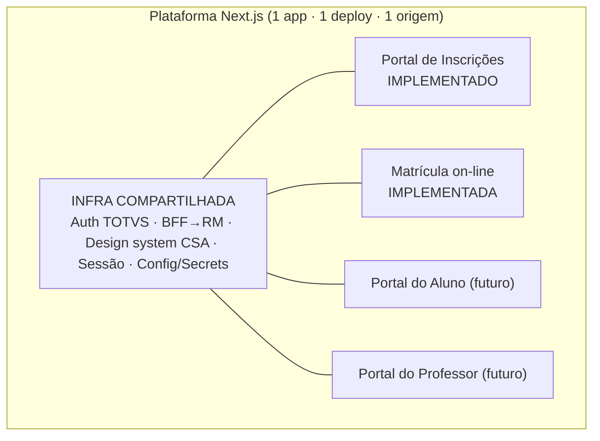
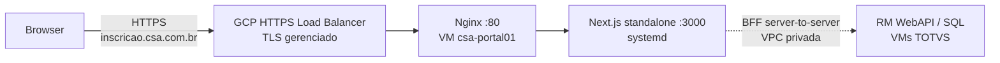

# Arquitetura — Plataforma Next.js integrada ao TOTVS RM (Inscrição e Matrícula)

**Contexto:** TOTVS Educacional / Linha RM / Portal do Processo Seletivo (WebAPI EduPS)
**Servidor RM:** VM Windows (IIS) na GCP — `inscricao.csa.com.br`
**Objetivo:** entregar uma experiência própria para todo o percurso de admissão:
hotsite, cadastro, inscrição, boleto da taxa, acompanhamento, matrícula dos candidatos
aprovados, contrato e boleto de reserva de matrícula, mantendo o RM como sistema
autoritativo e integrando os marcos do processo ao RD Station.
**Documento criado em:** 26/06/2026

**Estado revisado em:** 16/07/2026

> Premissas assumidas pelo projeto:
> - Temos **controle total** do servidor, do domínio e do DNS.
> - **Assumimos o risco de atualizações da TOTVS** (o sistema poderá ser atualizado/ajustado depois).
> - **Pagamentos:** apenas geração de **boleto** conforme a configuração do PS no RM. Todo o
>   esquema de transações on-line (cartão, PIX, gateways, antifraude) está **fora de escopo**.

---

## 0. Visão consolidada — uma plataforma, vários módulos

O projeto **não é um site avulso**: é **uma única plataforma Next.js** que, ao longo do
tempo, reunirá vários módulos sobre a **mesma infraestrutura compartilhada** (autenticação
TOTVS, camada BFF→RM, design system do CSA, sessão e configuração/segredos). Constrói-se
**um módulo de cada vez**, sempre reaproveitando essa fundação.



### 0.1. O hot site **é** o Portal de Inscrições

Ponto essencial: **o "hot site" e o "portal de inscrições" são a mesma coisa**, não dois
projetos. A landing institucional (hero + os dois editais + captura de lead) é a **porta de
entrada** do portal de inscrições; o fluxo de inscrição é a **continuação** dele. É **um
único módulo**, em estágios diferentes — não se separa "marketing" de "inscrições".

### 0.2. Crescimento por módulos

Cada novo portal (aluno, professor, …) é apenas um **segmento de rota** que se
pluga na infra existente. Adicionar um módulo = criar a pasta da rota + as rotas de BFF
correspondentes, **sem alterar** o que já funciona.

Esse modelo já foi validado pela matrícula: a rota `/matricula` reutiliza autenticação,
sessão, cliente RM, leituras SQL, design system e operação do mesmo deploy.

### 0.3. Infra de autenticação genérica desde o início

Os portais TOTVS conversam com **WebAPIs distintas** do RM (Inscrições →
`TOTVSProcessoSeletivo`/EduPS; Aluno/Professor → `RM.Edu.WebAPI`/Educacional), mas **o
padrão de autenticação é o mesmo**: sessão por **cookie do RM**, capturada pelo BFF
server-side. Por isso a camada `lib/rm` (cliente) e `lib/auth` (sessão) nascem **genéricas**,
apontando para **qualquer WebAPI do RM**, e o `middleware.ts` protege as rotas dos portais.
Assim a autenticação já fica pronta para os módulos futuros.

### 0.4. Estrutura da plataforma

```text
app/
  page.tsx              # ENTRADA do Portal de Inscrições (o "hot site": hero + 2 editais + lead)
  inscricoes/           # fluxo nativo de inscrição e painel do responsável
  matricula/            # fluxo dedicado de matrícula dos candidatos elegíveis
  api/inscricao/        # BFF da inscrição, documentos, boleto e comprovante
  api/matricula/        # BFF da matrícula, contrato, documentos, planos e boleto
  api/jobs/             # conciliações RM → RD Station
  portal-aluno/         # FUTURO — outro módulo (auth TOTVS)
  portal-professor/     # FUTURO — outro módulo (auth TOTVS)
  middleware.ts         # protege rotas dos portais (sessão TOTVS)
components/             # design system CSA (compartilhado por todos os módulos)
lib/
  rm/                   # cliente RM genérico
  totvs/                # inscrição, matrícula, sessão e consultas SQL
  marketing/            # RD Marketing, RD CRM e conciliações
  processos.ts          # config dos PS de 2027 (IDs ps)
```

### 0.5. Estado atual dos módulos

| Módulo | Estado |
| --- | --- |
| Hot site e editais 2027 | Implementado |
| Cadastro/login do responsável e painel | Implementado |
| Wizard nativo de inscrição | Implementado |
| Documentos, boleto da taxa e comprovante | Implementado |
| Matrícula on-line de candidatos aprovados/em chamada | Implementado |
| Contrato e assinatura conforme parâmetros do RM | Implementado |
| Boleto de reserva de matrícula de **R$ 2.200** | Implementado |
| Integração RD Marketing e CRM | Implementada, com conciliações automáticas |
| Portal do Aluno e Portal do Professor | Futuros |

O guia visual e de conteúdo do hot site/portal de inscrições está em
[guia_hotsite_csa_leblon_2027.md](guia_hotsite_csa_leblon_2027.md).

---

## 1. Duas abordagens possíveis

Há dois caminhos para obter uma inscrição com a "nossa cara". Este documento registra os
dois e detalha o que foi escolhido.

### Opção A — Customização oficial TOTVS (dentro do portal)

Usar o mecanismo previsto pela TOTVS: templates `custom`, CSS próprio, imagens e flags em
`edups-constantes.global.config.js`. Detalhado em
[guia_customizacao_portal_processo_seletivo_totvs.md](guia_customizacao_portal_processo_seletivo_totvs.md).

- **Prós:** baixo esforço e baixo risco; reaproveita 100% da lógica do wizard, validações,
  serviços e pagamento; mantém suporte TOTVS; sem runtime adicional.
- **Contras:** você decora *dentro* da SPA AngularJS + componentes `edu-elements` (PO UI).
  Há um teto: estrutura de páginas, roteamento e componentes continuam sendo os da TOTVS, e é
  obrigatório preservar `ng-*`/bindings. Rebranding forte é possível; UX bespoke real, não.

### Opção B — Aplicação Next.js própria com BFF (escolhida)

Reescrever a interface em Next.js e conversar com a WebAPI do RM por meio de um
**BFF (Backend-for-Frontend)** nas rotas server-side do Next.

- **Prós:** liberdade visual total (seu design system, seu fluxo, suas telas e animações);
  o RM continua dono de autenticação, dados e geração de boleto.
- **Contras:** exige **reimplementar a orquestração** do wizard e o **modelo de dados do RM**;
  roda um runtime Node próprio; assume o risco de upgrades.

### Matriz de decisão (visual × esforço)

| Critério | Opção A (TOTVS custom) | Opção B (Next.js BFF) |
|---|---|---|
| Cores, tipografia, imagens, logos | Total | Total |
| Layout dos templates (HTML) | Alto (reescreve `.view.html`) | Total |
| Estrutura/fluxo/navegação | Limitado (herda a SPA) | Total |
| Componentes/UX bespoke | Limitado (preserva `ng-*`/PO UI) | Total |
| Reaproveita lógica/validações | Sim (de graça) | Não (reimplementa) |
| Esforço / risco | Baixo | Alto |
| Suporte TOTVS | Mantido | Assumido por nós |
| “Totalmente customizado visualmente” | ~70–85% | 100% |

> **Quando A basta:** rebranding forte do miolo de inscrição. **Quando B se justifica:** a
> experiência sob medida (fluxo, branding, performance) é um diferencial estratégico — caso deste projeto.

---

## 2. A WebAPI do RM (o que o front consome)

Base dos serviços (de [totvs-app.global.config.js](../FrameHTML/Web/js/totvs-app.global.config.js)
e `edups-constantes.global.config.js`):

```
/FrameHTML/RM/API/TOTVSProcessoSeletivo/:method
```

Todas as chamadas do portal original passam pelo wrapper `$totvsresource` (REST sobre
angular-resource). O inventário completo tem ~100 endpoints; com o pagamento simplificado a
boleto, o subconjunto necessário cai para ~20.

### 2.1. Autenticação e sessão

Login (`POST /v1/Login`) com o corpo:

```jsonc
{
  "CodColigada": 1,
  "CodFilial": 1,
  "IdPs": 123,
  "TipoIdentificacao": 0,   // 0=CPF | 1=RG | 2=Usuário | 3=Email
  "Login": "000.000.000-00",
  "Senha": "<base64>",      // btoa(encodeURIComponent(senha)) — ofuscação, NÃO criptografia
  "GuidsReservaVaga": ""
}
```

- O servidor protege os endpoints com o atributo **`[EduPSAuthorize]`** e devolve **HTTP 401**
  quando a sessão expira. **A autenticação é baseada em cookie/sessão do RM** (não há header
  `Authorization`/`Bearer`). A segurança de transporte depende de **HTTPS**.
- Reconhecimento de usuário existente: `Inscricao/ExisteUsuario`.
- Login automático/SSO via token: `LoginAutomatico`. Recuperação de senha: `RecuperarSenha`.

> **Importante:** quem valida a senha e é dono da identidade/sessão **continua sendo o RM**.
> Não recriamos a base de usuários — autenticamos contra ela. A tela de login é 100% nossa.

### 2.2. Endpoints necessários (escopo boleto)

| Etapa | Endpoints |
|---|---|
| **Catálogo** | `ListaProcessosSeletivos/...`, `ListaAreaOfertadaParaInscricoes`, `ListaGruposAreaInteresse/...`, `InfoAreaOfertadaDocumentOferta/...`, `GetParamsAreaOfertada` |
| **Reconhecimento/Login** | `Inscricao/ExisteUsuario`, `v1/Login`, `Logout`, `RecuperarSenha`, `LoginAutomatico` |
| **Cadastro** | `Inscricao/v2/BuscaUsuario`, `Inscricao/Usuario` (salvar) |
| **Inscrição (wizard)** | `Inscricao/NovaInscricao`, `TermoAceitePS/...`, `Inscricao/QuestionarioConstantesTestis`, `Inscricao/VerificaSeQuestionarioFoiRespondido`, `Inscricao/Reserva` |
| **Domínios (combos)** | `ListaEstados`, `ListaMunicipios/...`, `BuscaEnderecoPorCEP/...`, `ListaCorRaca`, `ListaEstadoCivil`, `ListaNacionalidade`, `ListaTipoDeficiencia`, … |
| **Boleto + Comprovante** | `InfoBoletoInscricao` → `URLBOLETOFIXO`/`URLREGONLINE`, `BoletoFixoTaxaInscricao`, `2aviaBoletoCandidato`, `Inscricao/Comprovante` |
| **Telemetria** | `Inscricao/NotificaInteracao`, `Inscricao/NotificaInteracaoEvento` (úteis para espelhar no RD Station) |

Distribuição de verbos no portal original: ~77 GET, ~45 Query, ~21 POST, ~5 Update.

### 2.3. Modelo de dados do RM (atenção ao reimplementar)

Os payloads usam **datasets do RM** (ex.: arrays `SPSUSUARIO[]` com campos como `CORRACAOBJ`,
`ESTADOCIVILOBJ`, `IPCLIENT`). Reproduzir esse formato fielmente é o **grosso do esforço** da
Opção B. Há **duas formas** de levantar esse schema:

1. **Captura de rede** (DevTools/Fiddler) rodando o portal oficial — fiel ao que o EduPS espera.
2. **Discovery via DataServers** (ver 2.5): os campos do dataset espelham as tabelas do RM, cujo
   schema é obtido por REST sem navegador. Mais rápido para *modelar*; a validação final do
   `NovaInscricao` ainda confirma o formato exato.

### 2.4. Pagamento simplificado — boleto via URL do RM

O RM gera o boleto **server-side**. O portal original apenas abre a URL retornada:

```ts
// após NovaInscricao
const r = await bff('/InfoBoletoInscricao', { numeroInscricao });
const url = r.URLBOLETOFIXO || r.URLREGONLINE;   // RM já gerou o boleto
// front: <a href={url} target="_blank">Gerar/baixar boleto</a>  (+ botão 2ª via -> 2aviaBoletoCandidato)
```

- **Sem dado de cartão → fora do escopo PCI.** Resta LGPD (PII), que é gerenciável.
- A confirmar por captura de rede: se o boleto é criado automaticamente em `NovaInscricao` ou
  exige chamada explícita a `BoletoFixoTaxaInscricao`; e o tratamento de **PS isento de taxa**
  (não gera boleto → pula a etapa e vai ao comprovante).

### 2.5. Segunda superfície — DataServers / REST T-Talk (leitura/referência)

Além da WebAPI EduPS (no IIS `…/FrameHTML`), o **RM.Host** expõe os **DataServers** do RM via
REST T-Talk, normalmente noutro host/porta (nos scripts existentes: `http://35.247.234.33:8051`).

- **Autenticação:** JWT de serviço em `POST /api/connect/token` (credenciais de staff), **não**
  o cookie do candidato. É um canal **administrativo** — manter server-side e com IP restrito.
- **Acesso:** `RMSRestDataServer` — `GET /rest/{DataServer}?filter=&start=&limit=` (GetAll),
  `GET /rest/{DataServer}/{id}` (Get), `GET /service/{DataServer}/schema` (schema).
- **Uso na plataforma:** **somente LEITURA / dados de referência** — PS ativos, oferta de
  cursos/áreas, planos de pagamento e *lookup* de pessoa por CPF (cadastro existente). Isso
  **dispensa a captura no navegador** para os dados de catálogo e ajuda a modelar o dataset.
- **Escrita continua na EduPS WebAPI** (`NovaInscricao`, boleto): gravar direto via
  `EduCandidatoProcSelData` burlaria as regras do PS (reserva de vaga, geração de boleto).

DataServers relevantes: `EduCandidatoProcSelData`, `EduControleCandMatrProcSelData`,
`EduPessoaData`, `EduResponsavelData`, `EduFiadorData`, `EduPlanoPgtoData`, `EduBoletoData`,
`EduCursoData`, `EduHabilitacaoFilialData`.

Implementação: [plataforma/lib/rm/dataserver.ts](../plataforma/lib/rm/dataserver.ts) (client JWT +
RMSRestDataServer) e o script [plataforma/scripts/rm-discovery.mjs](../plataforma/scripts/rm-discovery.mjs)
(`pnpm rm:discovery`) que baixa schema + amostra dos DataServers alvo.

> ⚠️ Credenciais e PII: o JWT é de staff (privilegiado) e as amostras podem conter dados
> pessoais — `scripts/discovery-out/` é git-ignored; credenciais só em `.env.local`.

---

## 3. Arquitetura implementada

**Front-end Next.js (com BFF) rodando como serviço Node nativo em uma VM Linux pequena na
mesma VPC da VM Windows (RM). A entrada pública é um **GCP External HTTPS Load Balancer**;
na VM, o **Nginx** encaminha para o processo Next.js.

> **Sem Docker.** O Next.js roda diretamente como processo Node gerenciado por `systemd`.



Dois caminhos:
- **Browser → Load Balancer → Nginx → Next**: aqui vive o **cookie de sessão do BFF** (httpOnly).
- **Next (BFF) → RM** (privado, dentro da VPC, **IP interno**): server-to-server, segurando o
  cookie do RM no servidor. O browser **nunca** toca o RM nem a VM Linux diretamente → **sem CORS**.

### 3.1. Sessão e login de usuário existente

- A tela de login é nossa; envia credenciais ao **BFF** (Next server-side).
- O BFF chama `v1/Login` no RM (senha em base64), captura o **cookie de sessão do RM** e o guarda
  no servidor, emitindo ao browser **um cookie de sessão próprio** (httpOnly, Secure, SameSite=Lax)
  na origem `inscricao.csa.com.br`.
- O `401` do RM (sessão expirada) é traduzido no nosso fluxo de re-login.
- **1 instância** (esta arquitetura) → store de sessão **in-memory** basta. Ao escalar no futuro,
  usar store compartilhado (ver §5).

Exemplo (App Router):

```ts
// app/api/auth/login/route.ts  (BFF)
import { cookies } from 'next/headers';
const RM = process.env.RM_API_BASE!; // http://<IP-privado-windows>/FrameHTML/RM/API/TOTVSProcessoSeletivo

export async function POST(req: Request) {
  const { login, senha, tipoIdentificacao, codColigada, codFilial, idPS } = await req.json();
  const model = {
    CodColigada: codColigada, CodFilial: codFilial, IdPs: idPS,
    TipoIdentificacao: tipoIdentificacao, Login: login,
    Senha: Buffer.from(encodeURIComponent(senha)).toString('base64'),
    GuidsReservaVaga: '',
  };
  const r = await fetch(`${RM}/v1/Login`, {
    method: 'POST', headers: { 'Content-Type': 'application/json' }, body: JSON.stringify(model),
  });
  const rmCookie = r.headers.get('set-cookie') ?? '';
  if (rmCookie) {
    cookies().set('rm_sess', rmCookie, { httpOnly: true, secure: true, sameSite: 'lax', path: '/' });
  }
  return new Response(await r.text(), { status: r.status });
}
```

### 3.2. Fluxo do candidato

```
Catálogo → Reconhecimento/Login → Cadastro → Inscrição → Boleto da taxa → Comprovante
```

1. **Catálogo:** lista de PS e áreas ofertadas.
2. **Reconhecimento:** `Inscricao/ExisteUsuario` → decide login (existente) ou cadastro (novo).
3. **Login/Cadastro:** `v1/Login` / `Inscricao/v2/BuscaUsuario` + `Inscricao/Usuario`.
4. **Inscrição (wizard):** `NovaInscricao`, `TermoAceitePS`, questionário, `Reserva`.
5. **Boleto:** `InfoBoletoInscricao`/`BoletoFixoTaxaInscricao` → entrega `URLBOLETOFIXO` (+ 2ª via).
6. **Comprovante:** `Inscricao/Comprovante`.

#### 3.2.1. Reconhecimento e login por CPF do responsável (regra de negócio)

O acesso é sempre pelo **CPF do responsável**. O nome e os demais dados só são pedidos
depois — exceto quando o responsável já existe no TOTVS, caso em que os dados são lidos
do sistema e exibidos **apenas para confirmação**.

```
[CPF do responsável]
        │  reconhecerResponsavelPorCpf(cpf)  (leitura SQL — SPSUSUARIO)
        ▼
   ┌────────────┐  existe = true                ┌────────────┐  existe = false
   │ RECONHECIDO│ ───────────────►              │   NOVO     │ ───────────────►
   └────────────┘                               └────────────┘
   • exibe nome + e-mail mascarado p/ confirmar  • segue cadastro normal: pede nome
   • pede a SENHA → EduPS `LoginNovoPortal`        e demais dados conforme o PS
     (tipoIdentificacao=0/CPF, senha base64)     • criação/inscrição via EduPS
   • "Esqueci minha senha" → EduPS                 (`InsereInscricao`, etc.)
     `RecuperarSenha` (opção da TOTVS)
```

- `temSenhaCadastrada` (flag de `reconhecerResponsavelPorCpf`) indica se o login usa
  **senha própria** ou **data de nascimento** — em `SPSUSUARIO`, ~63% das contas têm senha
  própria; as demais autenticam por data de nascimento (parametrização do RM, conforme a
  doc de `LoginNovoPortal`: *"senha cadastrada ou data de nascimento"*).
- O **reconhecimento** é leitura (SQL direto, rápido); **autenticação, redefinição de senha
  e cadastro** continuam pela WebAPI EduPS (fonte autoritativa das regras do PS).
- **Segurança:** a rota BFF de reconhecimento expõe a existência de cadastro a partir de um
  CPF → exigir **rate-limit / proteção contra enumeração** e retornar **apenas dados
  mascarados** (nunca e-mail/telefone completos antes do login).

#### 3.2.2. Múltiplos candidatos por responsável (sem duplicar o mesmo candidato)

Um responsável (CPF) pode inscrever **vários candidatos** no mesmo PS, mas **não o mesmo
candidato duas vezes**. Confirmado no portal TOTVS (`js/inscricoes-irmaos/`,
`js/centralcandidato/`):

- O front mantém `$rootScope.inscricaoIrmaos.candidatos[]` (um objeto por candidato); o
  **CPF do responsável** é o mesmo para todos, e cada candidato tem identidade própria.
- "Adicionar candidato" / "Novo dependente" / "Nova inscrição para dependente existente"
  (funções em `centralcandidato.service.js`) levam ao wizard com `novoDependente: true|false`
  e, quando aplicável, `codUsuarioPSDependente`.
- **Identidade do candidato** = conta do portal `CODUSUARIOPS` (ou, para um novo cadastro,
  o **CPF do candidato** / passaporte / RG, conforme o grupo de busca configurado no PS).
- **Onde a inscrição vive:** `SPSINSCRICAOAREAOFERTADA` (PK `CODCOLIGADA,IDPS,NUMEROINSCRICAO`;
  colunas `CODUSUARIOPS`, `CODPESSOA`, `CODPESSOARESPONSAVEL`, `STATUS` — 1=ativa). É **1 linha
  por área/opção**, então o banco **não** tem unique para `(candidato, PS)`.
- **Bloqueio autoritativo:** a duplicidade é barrada pela **WebAPI EduPS no submit**
  (`/Inscricao/v2/BuscaUsuario` retorna flag `Bloqueia`; mensagens `l-msg-cadastro-ja-existente*`).
  Não há constraint de banco — **não** tente impedir por SQL direto.
- **Pré-check de UX (nosso, leitura):** `candidatoJaInscritoNoProcesso(idps, codUsuarioPS)` e
  `candidatoCpfJaInscritoNoProcesso(idps, cpf)` em `lib/totvs/queries.ts` consultam
  `SPSINSCRICAOAREAOFERTADA` (STATUS=1) só para **avisar antes** — a decisão final é da EduPS.

```
Responsável (CPF) ── inscreve ──► [candidato A] [candidato B] [candidato C]  (mesmo PS) ✅
                                        │
                       candidatoJaInscritoNoProcesso(idps, codUsuarioPS) → avisa se repetir
                                        │ (autoritativo)
                       EduPS /Inscricao/v2/BuscaUsuario → Bloqueia mesmo candidato no mesmo PS
```

---

## 4. Proposta histórica de deploy: IIS como entrada única

> Esta seção preserva a proposta arquitetural inicial para referência. Ela foi
> **substituída na implantação real** pelo GCP External HTTPS Load Balancer + Nginx descrito
> na seção 3. Os nomes, comandos e exemplos abaixo não devem ser usados para operar
> produção. O procedimento vigente está em `runbook-deploy-portal.md`.

### 4.1. Provisionar a VM Linux

- `e2-small` (ou `e2-medium`) com uma distro LTS (ex.: Debian/Ubuntu), na **mesma VPC e
  sub-rede** da VM Windows do RM.
- **Sem IP público**; usar **Cloud NAT** apenas para baixar pacotes/dependências.
- Instalar **Node LTS**.

### 4.2. Build e execução nativa (systemd)

Use Next em modo **standalone** (`output: 'standalone'` no `next.config.js`).

```bash
# na VM Linux
cd /opt/inscricao-next
npm ci
npm run build        # gera .next/standalone + .next/static
```

Serviço `systemd` (`/etc/systemd/system/inscricao-next.service`):

```ini
[Unit]
Description=Inscricao Next.js (BFF)
After=network.target

[Service]
Type=simple
WorkingDirectory=/opt/inscricao-next
# Next standalone gera server.js; ele honra a variável PORT
Environment=NODE_ENV=production
Environment=PORT=3000
Environment=HOSTNAME=0.0.0.0
Environment=RM_API_BASE=http://10.0.0.5/FrameHTML/RM/API/TOTVSProcessoSeletivo
Environment=SESSION_SECRET=__defina_no_secret_manager__
ExecStart=/usr/bin/node server.js
Restart=always
RestartSec=3
User=www-data

[Install]
WantedBy=multi-user.target
```

```bash
sudo systemctl daemon-reload
sudo systemctl enable --now inscricao-next
```

> **BFF → RM pelo IP privado** da VM Windows (`RM_API_BASE`), nunca pela URL pública, para
> evitar loopback pela internet a cada passo do wizard.

### 4.3. Firewall da VPC (somente tráfego interno)

```bash
# IIS (VM Windows) -> Next (VM Linux, porta 3000)
gcloud compute firewall-rules create allow-iis-to-next \
  --network=SUA_VPC --direction=INGRESS --action=ALLOW \
  --rules=tcp:3000 --source-ranges=<IP-privado-ou-subrede-da-VM-Windows>

# BFF (VM Linux) -> RM (VM Windows, 80/443)
gcloud compute firewall-rules create allow-bff-to-rm \
  --network=SUA_VPC --direction=INGRESS --action=ALLOW \
  --rules=tcp:80,tcp:443 --source-ranges=<subrede-da-VM-Linux>
```

### 4.4. IIS como entrada única (reverse proxy)

Pré-requisitos no IIS: módulos **Application Request Routing (ARR)** e **URL Rewrite**; em ARR,
habilitar *Server Proxy Settings → Enable proxy*.

`web.config` do site `inscricao.csa.com.br`:

```xml
<?xml version="1.0" encoding="UTF-8"?>
<configuration>
  <system.webServer>
    <rewrite>
      <rules>
        <!-- 1) RM continua servido pelo próprio IIS (NÃO faz proxy) -->
        <rule name="RM-FrameHTML" stopProcessing="true">
          <match url="^FrameHTML/.*" />
          <action type="None" />
        </rule>
        <!-- 2) Todo o resto vai para o Next.js na VM Linux (IP privado:3000) -->
        <rule name="ReverseProxyToNext" stopProcessing="true">
          <match url="(.*)" />
          <action type="Rewrite" url="http://10.0.0.6:3000/{R:1}" />
          <serverVariables>
            <set name="HTTP_X_FORWARDED_HOST" value="{HTTP_HOST}" />
            <set name="HTTP_X_FORWARDED_PROTO" value="https" />
          </serverVariables>
        </rule>
      </rules>
    </rewrite>
  </system.webServer>
</configuration>
```

Resultado: `https://inscricao.csa.com.br/FrameHTML/...` → RM (mesma origem) e
`https://inscricao.csa.com.br/...` → Next.js. Como tudo é **mesma origem**, os cookies fluem
sem CORS.

### 4.5. TLS e segredos

- **TLS termina no IIS** (certificado do site). Tráfego interno na VPC pode ser HTTP.
- Credenciais/URLs do RM e `SESSION_SECRET` via **Secret Manager** → variáveis de ambiente do
  serviço (nunca no código/repositório).

### 4.6. Operação

- `systemctl status inscricao-next`, logs via `journalctl -u inscricao-next`.
- Healthcheck simples (ex.: rota `/api/health`) para monitoração.
- Deploy: build no CI → publicar artefato standalone na VM (rsync/scp) → `systemctl restart`.

---

## 5. Opções futuras (documentadas, não usadas agora)

> Não serão adotadas nesta fase, mas ficam registradas como evolução.

### 5.1. GCP External HTTPS Load Balancer como entrada (em vez do IIS)

Roteamento por path nativo, TLS gerenciado, health checks e escala:

- Dois **backend services**: VM Windows (porta 80, para `/FrameHTML/*`) e VM Linux (porta 3000, default).
- **URL map**: `/FrameHTML/*` → backend Windows; `/*` → backend Linux.
- Certificado gerenciado para `inscricao.csa.com.br`; DNS aponta para o IP do LB.
- Ranges de health check/proxy do GCLB a liberar no firewall: `130.211.0.0/22`, `35.191.0.0/16`.

Vantagem: tira o IIS do caminho do app novo (RM continua atrás do IIS) e habilita autoscaling.

### 5.2. Cloud Run para o container do Next

- Serverless, escala a zero, HTTPS gerenciado.
- Requer **Serverless VPC Access Connector** para o BFF alcançar o **RM interno** na VPC.
- Como pode haver **várias instâncias**, a sessão do BFF precisa de **store compartilhado**
  (**Memorystore/Redis**) ou sticky sessions — não usar mais in-memory.
- Trade-offs: **cold start** e a natureza "tagarela" do BFF↔RM tornam essa opção menos
  indicada enquanto o volume não justificar; ótima para escalar no futuro.

### 5.3. Escala do BFF

Ao rodar mais de uma instância (LB com várias VMs ou Cloud Run), migrar o store de sessão de
in-memory para **Memorystore (Redis)**.

---

## 6. Integração com RD Station

A integração é server-side, best-effort e não bloqueia os fluxos do RM. O RD Marketing
recebe conversões e o RD CRM mantém uma negociação por inscrição.

O pipeline implementado é:

```text
Inscrito → Taxa paga → Prova/Entrevista →
Cadastro de matrícula → Pré-matrícula → Matriculado
```

- **Inscrito:** inscrição gravada e boleto da taxa gerado.
- **Taxa paga:** conciliação por `FLAN.STATUSLAN=1`.
- **Cadastro de matrícula:** matrícula efetivada, com RA e boleto de reserva gerado.
- **Pré-matrícula:** boleto de reserva de **R$ 2.200** pago.
- **Matriculado:** etapa final controlada manualmente após assinatura/validação operacional.

Ao efetivar a matrícula, a aplicação dispara uma conciliação best-effort para avançar o
deal imediatamente. Um cron horário executa a mesma lógica como rede de segurança. O
processamento é idempotente e somente avança etapas; nunca regride uma negociação.

Detalhes, campos e operação: `integracao_rd_station.md`.

---

## 7. Riscos e considerações

- **Upgrades da TOTVS:** contrato interno e modelo de dados podem mudar; risco **assumido** —
  prever revalidação por captura de rede após cada atualização do RM.
- **Reimplementação do wizard:** é o maior esforço da Opção B (orquestração + datasets do RM).
- **LGPD:** PII do candidato trafega pelo BFF; manter minimização, retenção e consentimento.
- **Latência BFF↔RM:** manter as duas VMs na **mesma VPC/sub-rede** e usar **IP privado**.

---

## 8. Evolução entregue

1. **Fundação e inscrição:** hot site, autenticação, cadastro, wizard, documentos,
   boleto da taxa e comprovante.
2. **Operação e CRM:** criação de deals, conciliação da taxa e atribuição de origem.
3. **Matrícula on-line:** elegibilidade, dados pessoais, responsáveis, documentos,
   planos, contrato/assinatura, efetivação e consulta por RA.
4. **Reserva de matrícula:** emissão/segunda via do boleto de **R$ 2.200** e conciliação
   das etapas `Cadastro de matrícula` e `Pré-matrícula` no RD Station.
5. **Próximas evoluções:** HA com sessão/rate limit compartilhados, Portal do Aluno e
   Portal do Professor.
