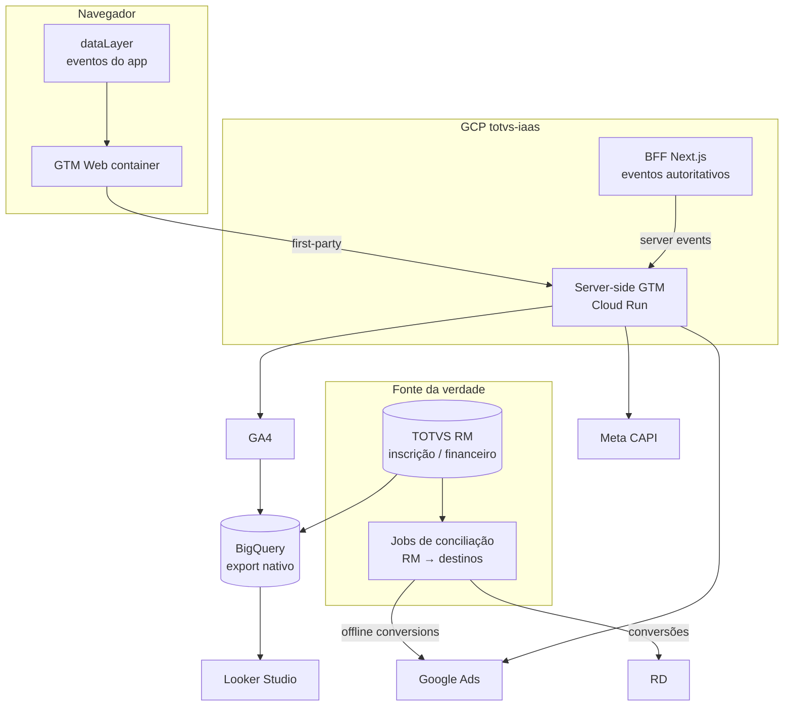
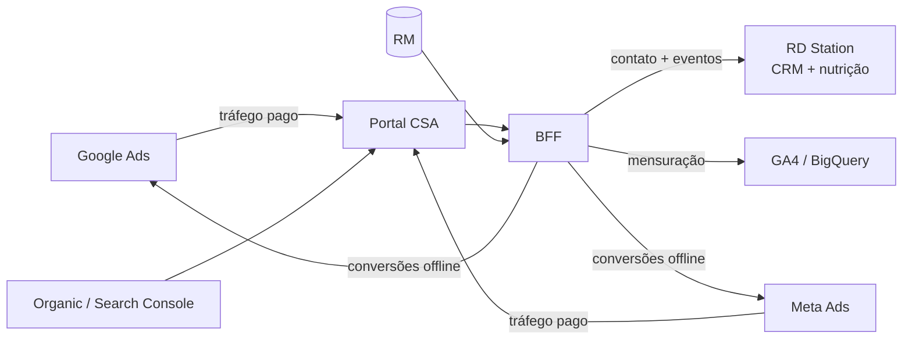

# Estratégia de Captação, Marketing e CRM — Google + RD Station (nível ouro)

**Contexto:** Portal de Inscrições e Matrícula do CSA Leblon (plataforma Next.js/BFF própria,
com controle total de desenvolvimento e infra na GCP, projeto `totvs-iaas`).
**Objetivo:** desenhar um ecossistema de mensuração e aquisição **moderno, server-side e
resistente** que aproveite o controle total da plataforma para otimizar a captação de
alunos — não pelo "clique no formulário", mas pela **matrícula efetivada**.
**Criado em:** 17/07/2026. Complementa `integracao_rd_station.md` e `integracao_meta.md`.

> Este é um documento de **estratégia e roadmap**. Nada aqui está implementado além do que
> os docs de RD e Meta já descrevem (GA4 client-side, Meta Pixel+CAPI, RD Marketing+CRM).
> As seções marcam claramente **[existe]** x **[proposto]**.

---

## 1. Princípio central: o que nos torna diferentes

A maioria dos anunciantes otimiza campanhas pelo **lead** (envio de formulário). Numa escola,
o lead é barato e enganoso: o que importa é a **matrícula paga**, que acontece **semanas
depois, offline**, dentro do RM. Nosso funil real:

```text
Visita → Lead → Inscrição → Taxa paga (R$200) → Prova/Entrevista →
Matrícula → Reserva paga (R$2.200) → Matriculado
```

Como temos **controle total da plataforma e do dado autoritativo (RM)**, podemos fazer o que
um site de terceiros não faz: **devolver a matrícula real para dentro do Google Ads e do
Meta**, para que os algoritmos de lance otimizem por *quem matricula*, não por *quem
preenche*. Esse é o pilar "ouro" de toda a estratégia.

**Cinco princípios que orientam todas as decisões abaixo:**

1. **Server-side first.** O evento autoritativo nasce no **BFF** (já é assim para Meta CAPI e
   RD). O browser é reforço, não a fonte da verdade. Resistente a adblock/ITP.
2. **Dado de 1ª parte é a espinha.** E-mail/telefone (com hash), `gclid`, `user_id` estável
   e `event_id` para deduplicação — a mesma identidade atravessa GA4, Ads, Meta e RD.
3. **Conversões offline fecham o ciclo.** O valor real (taxa e reserva) é conciliado a partir
   do RM e **exportado** para as plataformas de mídia — reusando o padrão de conciliação já
   existente.
4. **Consentimento por design (LGPD + Consent Mode v2).** Um único cookie de preferências
   (`csa_consent`) governa navegador **e** servidor.
5. **Uma taxonomia de eventos, muitos destinos.** O mesmo marco de funil vira evento em GA4,
   conversão no Ads, evento no Meta e conversão no RD — com nomes consistentes.

---

## 2. Arquitetura alvo



**Três caminhos de dados, cada um no seu papel:**

- **Navegador → GTM Web → sGTM:** interações imediatas (PageView, cliques, início de wizard).
  O GTM Web dá **autonomia ao time de marketing** para criar/editar tags sem depender de
  deploy de engenharia.
- **BFF → sGTM (ou API direta):** eventos autoritativos que dependem de estado do servidor
  (inscrição gravada, boleto, matrícula). É o que já fazemos com Meta CAPI e RD — estende-se
  para GA4 (Measurement Protocol) e Ads.
- **RM → Jobs de conciliação → Ads/Meta/RD:** as **conversões offline de alto valor** (taxa
  paga, reserva paga, matrícula) que só existem no financeiro do RM, exportadas por um job
  no mesmo molde de `conciliar-pagamentos`/`conciliar-matriculas`.

### 2.1. Server-side GTM (sGTM): por que e onde

O **sGTM** é o marco do padrão "ouro" moderno e encaixa na nossa infra:

- Roda em **Cloud Run** no `totvs-iaas` (ou na própria VM), sob um subdomínio de 1ª parte
  (ex.: `sgtm.csa.com.br`, atrás do mesmo LB/Azion).
- **Cookies de 1ª parte gravados no servidor** → `client_id`/`session_id` do GA4 e `_fbp`
  duráveis, driblando o ITP do Safari (cookies JS limitados a 7 dias).
- **Um único ponto de coleta** que faz fan-out para GA4 + Ads + Meta, com o token de cada
  plataforma **fora do navegador**.

> **Recomendação de faseamento:** começar com **GTM Web + eventos autoritativos no BFF**
> (baixo custo, aproveita o que já existe) e subir o **sGTM** na Fase 2, quando o ganho de
> durabilidade de cookie e de governança justificar o Cloud Run. O BFF **permanece** dono das
> conversões offline (matrícula/pagamento), que nenhum GTM conhece.

---

## 3. Ferramentas Google — o que usar, o papel e a prioridade

| Ferramenta | Papel no projeto | Prioridade |
| --- | --- | --- |
| **Google Analytics 4** | Mensuração central do funil; key events; export para BigQuery | Alta — **[existe]**, evoluir |
| **Google Tag Manager (Web)** | Orquestração de tags client-side; autonomia do marketing | Alta — **[proposto]** |
| **Server-side GTM (Cloud Run)** | Coleta de 1ª parte + fan-out server-side; cookies duráveis | Média/Alta — **[proposto, Fase 2]** |
| **Google Ads** | Aquisição paga; consumidor das conversões (inclui **offline**) | Alta — **[proposto]** |
| **Enhanced Conversions for Leads** | Casar lead (e-mail com hash) ao clique, sem depender só de cookie | Alta — **[proposto]** |
| **Offline Conversion Import** | Devolver **matrícula/taxa reais** ao Ads via `gclid`/e-mail | Alta — **o diferencial ouro** |
| **Consent Mode v2** | Sinais de consentimento p/ Google, integrados ao `csa_consent` | Alta — **[proposto]** |
| **BigQuery** | Export nativo do GA4 + join com dados do RM = fonte única | Alta — **[proposto]** |
| **Looker Studio** | Dashboards unindo GA4 + Ads + RD + funil do RM | Média — **[proposto]** |
| **Google Search Console** | SEO/organic do hotsite; termos que trazem inscrição | Média — **[proposto]** |
| **Customer Match / Google Ads Data Manager** | Listas de 1ª parte (base RD/RM) p/ remarketing e públicos semelhantes | Média — **[proposto]** |
| **reCAPTCHA Enterprise** | Proteção dos formulários (anti-bot, anti-enumeração de CPF) | Média — complementa o rate-limit atual |
| Merchant Center / Shopping | — | **Não se aplica** (sem catálogo/e-commerce) |
| Display & Video 360 / CM360 | Mídia programática de grande escala | **Fora de escopo** (overkill p/ uma unidade) |
| Firebase | App mobile | **Fora de escopo** (não há app) |

---

## 4. RD Station no ecossistema — divisão de papéis

RD e Google **não competem**; ocupam camadas diferentes. Definir isso evita duplicação e
"guerra de atribuição".



| Camada | Dono | Ferramenta |
| --- | --- | --- |
| **Aquisição paga** | Agência de mídia | Google Ads, Meta Ads |
| **Aquisição orgânica** | Escola/agência | SEO + Search Console |
| **Mensuração e análise** | Engenharia + dados | GA4, BigQuery, Looker |
| **CRM e nutrição** | Time de admissão | **RD Station** (Marketing + CRM) |
| **Fonte da verdade** | Secretaria/RM | TOTVS RM |
| **Orquestração (hub)** | Plataforma (BFF) | Next.js server-side |

- **RD Station** continua o **sistema de relacionamento**: nutrição por e-mail, lifecycle do
  lead, pipeline de admissão, motivos de perda — operado pelo time de admissão. **[existe]**
- **Google** é a camada de **aquisição + mensuração + otimização**: traz o tráfego e recebe de
  volta o sinal de matrícula para otimizar lances.
- O **BFF é o hub**: um único ponto que dispara, com consentimento e deduplicação, para todos
  os destinos. Já é o padrão (`lib/marketing/*`); a estratégia é **adicionar destinos Google**,
  não trocar de arquitetura.

---

## 5. A espinha de dado de 1ª parte (identidade e atribuição)

Tudo depende de amarrar a **mesma pessoa** ao longo de meses e entre plataformas.

| Sinal | Origem | Uso |
| --- | --- | --- |
| **E-mail + telefone (SHA-256)** | Cadastro do responsável | Enhanced Conversions (Ads), CAPI (Meta), contato (RD). Já feito no Meta CAPI (`meta-capi.ts`) |
| **`event_id`** | `eventIdInscricao/Matricula` **[existe]** | Deduplicação browser × servidor (Meta hoje; estender a GA4/Ads) |
| **`gclid` / `wbraid` / `gbraid`** | Query da landing (clique do Ads) | **[existe: captura]** lidos em `origem.ts` (URL + cookie de 1ª parte); **falta** persistir junto da inscrição + Offline Conversion Import |
| **GA4 `client_id` / `session_id`** | Cookie `_ga` (ou sGTM) | Amarrar sessão do browser ao Measurement Protocol server-side |
| **`user_id` estável** | `CODUSUARIOPS`/hash do CPF | **[proposto]** cross-device no GA4 e no BigQuery |
| **`__trf.src`** | Rastreador RD **[existe]** | Atribuição de origem no RD (`origem.ts`) |
| **UTMs** | Query/cookie **[existe]** | Reforço de atribuição (`origem.ts`) |

**Ação-chave [parcial]:** a **captura** de `gclid`/`wbraid`/`gbraid` já existe em
`lib/marketing/origem.ts` (lê da URL na visita e de cookie de 1ª parte). **Falta** persistir
esse identificador **junto da inscrição** (campo no RM ou store lateral) e fazer o **Offline
Conversion Import** por GCLID. Sem essa persistência+upload, só o método por e-mail (Enhanced
Conversions) funciona, que também recomendamos como reforço.

---

## 6. Plano de medição unificado (taxonomia única)

O mesmo marco vira evento em todos os destinos, com nomes consistentes. Base: o enum
`EtapaFunil` que já existe em `lib/marketing/rdstation.ts`.

| Marco de funil | `EtapaFunil` **[existe]** | GA4 (key event) | Google Ads | Meta | RD Station |
| --- | --- | --- | --- | --- | --- |
| Formulário de interesse | `lead-captado` | `generate_lead` | Lead (ECL) | `Lead` | conversão |
| Wizard iniciado | `inscricao-iniciada` | `begin_checkout` | — | `InitiateCheckout` | conversão |
| Série/área escolhida | `area-escolhida` | `add_to_cart`* | — | — | conversão |
| Inscrição concluída (boleto) | `boleto-gerado` | `add_payment_info` | — | `CompleteRegistration` **[existe]** | conversão |
| **Taxa paga (R$200)** | `pagamento-confirmado` | `purchase` | **Conversão offline** | `Purchase` | conversão + deal |
| **Matrícula (reserva gerada)** | `cadastro-matricula` | `purchase` | **Conversão offline** | `CompleteRegistration` **[existe]** | etapa CRM |
| **Reserva paga (R$2.200)** | `reserva-matricula-paga` | `purchase` | **Conversão offline (alto valor)** | `Purchase` | etapa CRM |

\* `add_to_cart` é aproximação; o importante é a consistência do nome e do `value/currency`.

**Regras de qualidade:**
- **`value` + `currency=BRL`** sempre nos eventos de compra (200 e 2.200) — permite ROAS real.
- **Deduplicação** por `event_id` (browser × servidor) e por idempotência nos jobs (já é o
  padrão da conciliação: nunca regride, só avança).
- **Marcar como *primary conversion* no Ads apenas a matrícula/reserva** — as demais entram
  como secundárias (observação), para o lance otimizar pelo que importa.

---

## 7. O diferencial ouro — conversões offline a partir do RM

É aqui que o controle total da plataforma vira vantagem competitiva de mídia.

### 7.1. Dois métodos, complementares

1. **Enhanced Conversions for Leads (por e-mail):** no envio do lead/inscrição, mandamos o
   **e-mail com hash** como conversão. O Google casa o clique (gclid) ao usuário. Depois,
   quando a matrícula acontece, subimos uma **conversão offline** para o mesmo e-mail. Menos
   frágil (não depende de guardar gclid). Reaproveita o hashing que já existe no `meta-capi.ts`.
2. **Offline Conversion Import por GCLID:** capturamos `gclid` na landing, persistimos e, no
   pagamento/matrícula, subimos a conversão com `gclid + horário + valor`. Mais robusto quando
   o e-mail não casa. Exige a captura de gclid da Seção 5.

**Recomendação:** implementar **ambos** — ECL como principal, GCLID como reforço.

### 7.2. Implementação: um novo job de conciliação

O padrão já existe. Assim como `conciliar-pagamentos`/`conciliar-matriculas` lêem o
`FLAN.STATUSLAN`/estado financeiro do RM e avançam o RD, propõe-se um job irmão:

```text
app/api/jobs/exportar-conversoes-google/   [proposto]
  → lê pagamentos/matrículas confirmados no RM (mesma leitura da conciliação RD)
  → monta conversões (taxa R$200 / reserva R$2.200) com gclid OU e-mail hasheado
  → chama a Google Ads API (Click/Conversion Upload)
  → idempotente: nunca reenvia o que já subiu
  → protegido por CRON_SECRET, no mesmo cron horário
```

- **Rede de segurança** igual à do RD: disparo best-effort ao efetivar + cron horário.
- **Segredos** (developer token, refresh token OAuth do Ads) só no `/etc/csa-portal/.env`.
- **Meta:** o mesmo job pode subir `Purchase` da taxa/reserva pela CAPI — hoje esses eventos
  **não** são enviados pelos jobs por falta de prova de consentimento persistida
  (ver `integracao_meta.md`); resolver isso (Seção 8) destrava também o Meta.

---

## 8. Consentimento — Consent Mode v2 + `csa_consent`

Já temos um cookie único de preferências (`csa_consent`) e a flag `NEXT_PUBLIC_CONSENTIMENTO_UI`.
A estratégia é **conectar isso ao Consent Mode v2 do Google** e **persistir a prova de
consentimento** para os jobs.

| `csa_consent` | Consent Mode v2 |
| --- | --- |
| `analytics: true` | `analytics_storage: granted` |
| `marketing: true` | `ad_storage`, `ad_user_data`, `ad_personalization: granted` |

- **Default `denied`** antes da escolha; **update** quando o visitante decide (quando o banner
  está ativo). Com a UI desativada (padrão atual), aplica-se o consentimento implícito já
  adotado — **decisão de LGPD do CSA**, registrada aqui para rastreabilidade.
- **Persistir a preferência de marketing junto da inscrição** (campo consultável) — resolve a
  lacuna atual que impede os jobs de enviar `Purchase` ao Meta/Ads com prova de consentimento.
- **Modelagem de comportamento do Google** com Consent Mode preenche parcialmente as lacunas
  de mensuração quando há recusa, sem violar a escolha.

---

## 9. Fonte única de verdade — BigQuery + Looker Studio

- **Export nativo GA4 → BigQuery** (gratuito até a cota; projeto `totvs-iaas`): dados de evento
  crus, sem amostragem.
- **Join com o RM:** subir para o BigQuery o resultado das conciliações (inscrição, taxa,
  matrícula) e cruzar com GA4/Ads por e-mail/`user_id` → **funil ponta a ponta com receita
  real por origem/campanha**. Isso responde à pergunta que nenhuma ferramenta isolada responde:
  *"qual campanha gerou matrícula — não clique?"*
- **Looker Studio** por cima: um painel para a agência (mídia/atribuição) e um para a
  secretaria (funil de admissão), ambos da mesma base.

---

## 10. Governança, LGPD e segurança

- **Tokens fora do browser:** Ads developer/refresh token, Meta CAPI, RD — só server-side
  (`.env` da VM). Padrão já vigente.
- **Hashing de PII** (SHA-256 de e-mail/telefone normalizados) antes de enviar a Ads/Meta —
  já implementado no `meta-capi.ts`, reusar.
- **Minimização e retenção:** definir janela de retenção no GA4 e no BigQuery; nunca enviar
  PII não-hasheada a plataformas de mídia.
- **reCAPTCHA Enterprise** nos formulários públicos, reforçando o `rate-limit` atual contra
  enumeração de CPF.
- **Base legal por etapa:** lead (consentimento) x responsável já cadastrado (relação
  contratual) — alinhar textos com `lib/legal/conteudo.ts` e o Aviso de Privacidade.

---

## 11. Roadmap por fases

| Fase | Entregas | Resultado |
| --- | --- | --- |
| **0 — Fundação (existe)** | GA4 client-side, Meta Pixel+CAPI, RD Marketing+CRM, conciliações | Mensuração básica e CRM operando |
| **1 — Google essencial** | GTM Web; GA4 com taxonomia de funil + key events; Consent Mode v2 ligado ao `csa_consent`; captura de `gclid`; Google Ads com Enhanced Conversions for Leads; Search Console | Aquisição paga medível; consentimento correto |
| **2 — O ciclo fechado (ouro)** | Job `exportar-conversoes-google` (offline: taxa e reserva); persistência da prova de consentimento; `Purchase` de taxa/reserva também no Meta | Ads/Meta otimizando por **matrícula real**, não por lead |
| **3 — Inteligência de dados** | Export GA4→BigQuery; join com RM; Looker Studio; Customer Match a partir da base | Atribuição de receita por campanha; públicos de 1ª parte |
| **4 — Escala** | sGTM em Cloud Run (cookies 1ª parte duráveis); testes de mídia (lookalike/semelhantes); nutrição avançada no RD por **segmentações** (operação manual da equipe do parceiro) | Durabilidade de medição e escala de aquisição |

---

## 12. Decisões a tomar (com a agência / o CSA)

- **Postura de consentimento** (banner ativo x consentimento implícito) — impacto direto de
  LGPD e de cobertura de mensuração.
- **Conta/estrutura do Google Ads** e quem terá acesso à API (developer token, OAuth).
- **Definição de conversão primária** no Ads: matrícula? reserva paga? ambas com pesos?
- **Valores de conversão:** usar R$200/R$2.200 fixos ou o valor real do plano quando existir.
- **Divisão operacional** RD (admissão) × Google (mídia/dados) e SLAs de relatório.
- **sGTM agora ou na Fase 4** (custo de Cloud Run × ganho de durabilidade).

---

## 13. Referências

- `docs/integracao_rd_station.md` — detalhe técnico do RD (eventos, campos, CRM).
- `docs/resumo-estrategico-rd-station.md` — visão executiva do funil e do CRM.
- `docs/integracao_meta.md` — Meta Pixel + CAPI + consentimento.
- `docs/arquitetura_nextjs_rm.md` — arquitetura BFF e integração com o RM.
- Código: `plataforma/lib/marketing/*` (rdstation, rdcrm, origem, meta-*), `app/api/jobs/*`.
