# Integração RD Station — Marketing, CRM e Funil de Admissão (CSA Leblon 2027)

> Documento de arquitetura e operação da captura de contatos, do funil de admissão e das
> negociações do Portal de Admissão. Descreve **o que o sistema faz hoje** (auditado
> contra o código), **quais dados são de fato enviados ao RD**, **como operar a plataforma
> RD** e uma **análise de boas práticas de marketing/CRM com sugestões de evolução**.
> Escrito para o time técnico e para o parceiro que opera o RD Station.

- **Última atualização:** 2026-07-30 (revisão completa contra o código-fonte)
- **Produtos-alvo:** RD Station **Marketing** (contatos + eventos de funil) e RD Station
  **CRM** (negociações/deals do pipeline de admissão)
- **Integrações correlatas:** Meta (Pixel + CAPI) — ver [integracao_meta.md](integracao_meta.md);
  Google Ads (conversão de inscrição) — ver §9.

## Estado atual da implementação (resumo executivo técnico)

| Frente | Situação | Observação |
| --- | --- | --- |
| **Marketing — eventos de funil (API Key)** | ✅ **Ativo** | 8 eventos emitidos de fato (ver §4) |
| **CRM — negociação da inscrição (deal)** | ✅ **Ativo** | criada no `boleto-gerado`, com **campos personalizados** (UUID) |
| **CRM — conciliação de pagamento da taxa** | ✅ **Ativo** | cron 2×/dia move o deal p/ *Taxa paga* e dispara `pagamento-confirmado` |
| **CRM — funil de pré-matrícula (reserva R$2.200)** | ✅ **Ativo** | cron horário move p/ *Cadastro de matrícula* / *Pré-matrícula* |
| **Agendador de visitas → Marketing + CRM** | ✅ **Ativo** | evento `visita-agendada` + deal de visita + **deal único** (visita→inscrição) |
| **Meta CAPI (visita)** | ✅ **Ativo** | evento `Schedule` sob consentimento |
| **Google Ads — conversão "Inscrição Concluída"** | ✅ **Ativo** | client-side (gtag), sob consentimento de marketing |
| **Rastreamento de origem (loader RD + UTM + gclid)** | ✅ **Ativo** | `client_tracking_id` do cookie `__trf.src` |
| **Origem/fonte (source) preenchida via API** | ✅ **Ativo** | `traffic_source` (Mkt) + `deal_source.name` (CRM) — **não editar à mão** (§5.4/§7.3) |
| **Temperatura do deal (`rating` — quente/morno/frio)** | ❌ **Não definido pelo sistema** | manual no CRM — equipe do parceiro, à mão (§5.4/§10.4) |
| **Estágio de ciclo de vida (Marketing: Lead→Cliente)** | ⚙️ **Configuração do parceiro** | mapeamento evento→estágio (config única) + sync nativa `cf_plug_*` (§5.4) |
| **Qualificação / lead scoring** | ❌ **Não automatizado** | sem flag/pontuação; classificação manual da equipe (§5.4/§10.4) |
| **Evento de topo `lead-captado` / rota `/api/lead`** | ❌ **Não existe** | declarado no type, **nunca emitido** (ver §4 e §10) |
| **Evento intermediário `area-escolhida`** | ✅ **Ativo** | beacon no wizard ao escolher a série (mede abandono por segmento) |
| **`visita-realizada` como evento de Marketing** | ✅ **Ativo** | emitido no cron de visitas na transição p/ *realizada* (§6.2/§8.3) |
| **Retry/backoff dos eventos de Marketing** | ✅ **Ativo** | retentativa em 429/5xx e erro de rede (`lib/marketing/retry.ts`) |
| **OAuth 2.0 + Events API + Webhooks (Passo 2)** | 🔜 **Planejado** | e-commerce nativo (Checkout/Order Paid/Abandoned Cart), Analytics |

> **Autenticação hoje:** Marketing por **API Key** (endpoint de Conversões); CRM por
> **token de instância** (API v1). OAuth ainda não é usado.

---

## 1. Por que isto existe (estratégia)

O hotsite **é** o portal de admissão. Cada pessoa que demonstra interesse — agenda uma
visita, faz login, cria conta, inicia uma inscrição — é um **contato** que pode (ou não)
concluir a inscrição, pagar a taxa e, aprovado, efetivar a matrícula. A integração existe
para **medir e nutrir todo o percurso**: não apenas "quem se inscreveu", mas **onde cada
pessoa parou** e **qual origem traz matrícula**.

Princípios (boas práticas de CRM/marketing aplicadas aqui):

- **Um contato, muitos eventos.** A chave do contato é o **e-mail**; o RD deduplica e monta
  a linha do tempo. Não é "1 lead = 1 envio", e sim um contato que **acumula eventos** ao
  longo do funil.
- **Estágios de ciclo de vida.** Visitante → Lead → Lead Qualificado → Oportunidade →
  Cliente. Cada marco do processo **promove** o contato.
- **Eventos server-side > pixel no browser.** Quase todos os eventos são disparados pelo BFF
  (Next.js): mais confiável (sem adblock) e permite usar dados que o browser não deve ver
  (ex.: o e-mail do responsável já cadastrado, lido do banco do RM). Meta e Google Ads são a
  exceção client-side (sob consentimento).
- **Medir abandono, não só sucesso.** O valor está em saber onde as pessoas param.
- **Atribuição desde o primeiro toque.** UTMs/origem respondem "qual campanha gera
  matrícula", não só clique.
- **LGPD por design.** Token só no servidor; e-mail completo nunca vai ao cliente;
  consentimento controla Meta/Google Ads.

---

## 2. Os dois produtos do RD Station e como o sistema fala com eles

| Produto | Para quê | Endpoint usado hoje | Credencial |
| --- | --- | --- | --- |
| **RD Station Marketing** | Contatos + eventos de funil (ciclo de vida) | `POST https://api.rd.services/platform/conversions?api_key=…` | `RD_STATION_TOKEN` (API Key) |
| **RD Station CRM** | Negociações (deals) do pipeline de admissão | `https://crm.rdstation.com/api/v1/…` (deals, contacts, deal_products) | `RD_CRM_TOKEN` (token de instância, por usuário) |

Ambos são **complementares e já estão ativos**. O Marketing recebe o **contato e o evento**
(dedup por e-mail); o CRM recebe a **negociação** (deal) para a equipe de admissão trabalhar
o pipeline.

### Marketing × CRM — a separação conceitual (medir × operar)

É comum confundir os dois porque **o mesmo fato aparece nos dois** — uma visita, por exemplo,
gera **um evento** no Marketing **e** **um deal** no CRM. Não é duplicidade: são duas
*representações* do mesmo momento, com finalidades distintas.

| | **RD Marketing** (`rdstation.ts`) | **RD CRM** (`rdcrm.ts`) |
| --- | --- | --- |
| Unidade de dado | **Evento/conversão** sobre um **contato** (chave = e-mail) | **Negociação (deal)** dentro de um **funil/pipeline** |
| Natureza | Registro **passivo**: "isto aconteceu no instante T" | Objeto de **trabalho**: um cartão que a equipe move e sobre o qual age |
| Responde | *Onde a pessoa está? Onde parou? Que origem/campanha trouxe?* | *O que fazer a seguir? Quem é o responsável? Quanto vale o pipeline?* |
| Finalidade | **Medir e nutrir** (segmentação, atribuição, abandono) | **Operar** o pipeline de admissão |
| Histórico | **Acumula** todos os eventos (timeline append-only) | **Consolida**: um deal por jornada |

**Por que a visita entra no CRM sem ferir "CRM = só deals".** Comercialmente, a visita é o
**início de uma negociação**: alguém entrou no funil e há algo a trabalhar (confirmar
comparecimento, convidar a se inscrever). Por isso ela é modelada **como um deal** no topo do
pipeline (`criarNegociacaoVisita`, §6.2), e não como um "evento avulso" — o princípio de que
*tudo no CRM é deal* continua válido. O evento de Marketing homônimo
(`visita-agendada`/`visita-realizada`) é outra coisa: o **fato registrado** na timeline do
contato, para medição/atribuição — algo que se *mede*, não que se *trabalha*.

**O detalhe que fecha o conceito (acumular × consolidar).** Quando a mesma pessoa se inscreve,
no **CRM** o deal de visita e a inscrição viram **um só cartão** (§6.3) — a equipe não fica com
duas negociações. No **Marketing**, os dois eventos (`visita-agendada` *e* `boleto-gerado`)
**permanecem** na timeline, porque ali o valor é justamente ver o percurso completo.

> **Em uma frase:** o Marketing registra **o que aconteceu** (para medir e nutrir); o CRM
> registra **o que há para trabalhar** (para operar). A visita é as duas coisas ao mesmo tempo,
> sem contradição.

### Filosofia comum das duas camadas (`lib/marketing/`)

- **Sempre server-side** — o token nunca vai ao browser.
- **Não-bloqueante** — qualquer falha do RD só gera log; **nunca** interrompe a inscrição,
  a matrícula ou o agendamento.
- **Modo stub** — sem o token configurado, a chamada vira apenas log (`[rdstation] (stub …)`
  / `[rdcrm] (stub …)`), útil em dev.

### Autenticação — o que é usado e o que falta

- **API Key (Marketing)** — endpoint *Conversão via API Key*. É o modo recomendado pela RD
  para transmitir conversões de sistemas internos. **É o que usamos.**
- **Token de instância (CRM v1)** — querystring `?token=…`. Simples, servidor↔servidor. **É
  o que usamos.**
- **OAuth 2.0** — necessário para a **Events API** (eventos de e-commerce nativos:
  *Checkout Iniciado*, *Pedido Pago*, *Carrinho Abandonado*), para o **CRM v2**, para
  **Analytics** e para configurar **Webhooks**. **Ainda não implementado** (Passo 2).

> **Boas práticas oficiais a observar:** domínio base `https://api.rd.services` sobre TLS;
> respeitar limites de requisição — os eventos de Marketing já têm **retry com backoff**
> em 429/5xx e erro de rede (`lib/marketing/retry.ts`); a chave do contato é o **e-mail**
> (dedup automático — "um contato, muitos eventos").

---

## 3. Arquitetura da integração (visão do sistema)

```mermaid
flowchart LR
    subgraph Browser
        U[Visitante / Responsável]
    end
    subgraph BFF[Next.js BFF — server-side]
        V["/api/visitas<br/>(visita-agendada + deal de visita)"]
        A2["/api/auth/login<br/>(login-responsavel)"]
        M["/api/marketing/inscricao-iniciada<br/>(inscricao-iniciada)"]
        I["/api/inscricao<br/>(cadastro-novo-responsavel + boleto-gerado + deal)"]
        MAT["/api/matricula<br/>(dispara conciliação da inscrição)"]
        J["/api/jobs/conciliar-*<br/>(cron: pagamento / matrícula / visitas)"]
        LIBM["lib/marketing/rdstation.ts<br/>registrarEventoFunil()"]
        LIBC["lib/marketing/rdcrm.ts<br/>deals + conciliação"]
    end
    subgraph TOTVS
        DB[(CorporeRM<br/>SQL — leitura)]
        EDU[EduPS WebAPI<br/>escrita/auth]
    end
    PG[(Postgres 'agos'<br/>store de visitas)]
    RDM[(RD Station<br/>Marketing)]
    RDC[(RD Station<br/>CRM)]

    U -->|agenda visita| V
    U -->|login| A2
    U -->|clica "incluir candidato"| M
    U -->|submissão da inscrição| I
    U -->|efetiva matrícula| MAT
    V --> PG
    A2 -->|SELECT e-mail server-side| DB
    I -->|EduPS NovaInscricao| EDU
    V --> LIBM
    A2 --> LIBM
    M --> LIBM
    I --> LIBM
    I --> LIBC
    J --> LIBM
    J --> LIBC
    LIBM -->|POST /platform/conversions| RDM
    LIBC -->|/api/v1/deals| RDC
```

**Regra de ouro:** o **token do RD nunca vai ao browser**. Marketing/CRM **nunca bloqueiam**
o fluxo do candidato — falhas só geram log.

---

## 4. O funil real, evento a evento (o que é enviado de fato)

Esta é a tabela **auditada contra o código** — inclui os campos que cada evento envia ao RD
Marketing. Todo evento envia sempre `cf_etapa_funil` e `cf_ano_processo`, além de
`email` (obrigatório — sem e-mail o evento é ignorado), `name`/`mobile_phone` quando
disponíveis, e a **atribuição de origem** (`client_tracking_id` + UTMs) quando há `req`.

| Evento (`EtapaFunil`) | Dispara em | Ciclo de vida | Campos específicos enviados |
| --- | --- | --- | --- |
| `visita-agendada` | `POST /api/visitas` (visita marcada) | Lead (topo) | `segmento`; `cf_data_visita`, `cf_local_visita`. **Sem `idps`** (visita não tem PS) |
| `visita-realizada` | Cron `conciliar-visitas` (comparecimento marcado na AGOS) | Lead Qualificado | `telefone`, `segmento`; `cf_data_visita`, `cf_local_visita`. **Sem UTM/`idps`** (cron, sem `req`) |
| `login-responsavel` | `POST /api/auth/login` (responsável **já cadastrado**) | Lead | `idps`; `cf_responsavel_reconhecido="true"` |
| `cadastro-novo-responsavel` | `POST /api/inscricao` (**novo** responsável, 1ª inscrição) | Lead | `telefone`, `idps` |
| `inscricao-iniciada` | `POST /api/marketing/inscricao-iniciada` (beacon "incluir candidato") | Lead Qualificado | `idps`; `cf_responsavel_reconhecido="true"` |
| `area-escolhida` | `POST /api/marketing/area-escolhida` (beacon ao escolher a série no wizard) | Lead Qualificado | `segmento`, `idps` |
| `boleto-gerado` | `POST /api/inscricao` (taxa gerada / inscrição concluída) | Oportunidade | `telefone`, `segmento`, `idps`; **rico** — ver abaixo |
| `pagamento-confirmado` | Cron `conciliar-pagamentos` (taxa paga no RM) | Cliente | `idps`; `cf_numero_inscricao`, `cf_nome_candidato`, `cf_data_pagamento_taxa`. **Sem UTM/telefone** (cron, sem `req`) |
| `cadastro-matricula` | Cron `conciliar-matriculas` (reserva **gerada**) | Cliente | `idps`; `cf_numero_inscricao`, `cf_nome_candidato`, `cf_valor_reserva` |
| `reserva-matricula-paga` | Cron `conciliar-matriculas` (reserva **paga**) | Cliente | `idps`; `cf_numero_inscricao`, `cf_nome_candidato`, `cf_valor_reserva`, `cf_data_pagamento_reserva` |

**Campos ricos do `boleto-gerado`** (evento de maior valor): `cf_numero_inscricao`,
`cf_valor_taxa`, `cf_nome_candidato`, `cf_processo_seletivo`, `cf_course_of_interest`
(reaproveita o campo padrão da conta, com o mesmo nome do PS), `cf_relacao_responsavel`
(pai/mãe/outro), `cf_responsavel_financeiro_distinto` (sim/nao) e — quando o responsável
financeiro é outra pessoa — `cf_nome_responsavel_financeiro`,
`cf_email_responsavel_financeiro`, `cf_telefone_responsavel_financeiro`.

**Identificador de conversão:** `inscricao-<ano>-<etapa>` (ou `-<etapa>-<segmento>` quando
há segmento). Ex.: `inscricao-2027-boleto-gerado-fundamental1`. O ano vem de
`RD_ANO_PROCESSO` (padrão `2027`).

### O que está declarado mas **não é emitido**

O type `EtapaFunil` ainda declara **`lead-captado`**, que **não é disparado hoje**:
dependeria de um formulário de interesse (LeadModal) e da rota `POST /api/lead`, que **não
existem**. Ou seja, **não há captura de lead anônimo** hoje — todo contato só entra quando
já tem e-mail (visita, login, cadastro ou inscrição).

> **Atualização:** `area-escolhida` e `visita-realizada` (como eventos de Marketing) — antes
> declarados mas não emitidos — **passaram a ser disparados**: `area-escolhida` via beacon do
> wizard ao escolher a série; `visita-realizada` no cron de visitas, na transição para
> *realizada* (§6.2/§8.3). Restam só `lead-captado` (topo anônimo).

```mermaid
flowchart LR
    V[visita-agendada] -->|Lead| L[login-responsavel]
    L -->|Lead| C[cadastro-novo-responsavel]
    C -->|Lead Qualif.| INI[inscricao-iniciada]
    INI -->|Lead Qualif.| AE[area-escolhida]
    AE -->|Oportunidade| B[boleto-gerado]
    B -->|Cliente| P[pagamento-confirmado]
    P --> CM[cadastro-matricula]
    CM --> RM[reserva-matricula-paga]
    INI -.->|abandono medido por segmento| AE
    B -.->|gerou e não pagou = recuperável| P
```



---

## 5. RD Station CRM — negociações (deals) em detalhe

O CRM está **ativo**. A cada `boleto-gerado`, o BFF cria uma **negociação** de forma
não-bloqueante (`registrarNegociacaoInscricao`, chamada em `app/api/inscricao`).

### 5.1 A negociação da inscrição

`POST https://crm.rdstation.com/api/v1/deals?token=…` com:

- **Nome:** `Inscrição nº <n> — <candidato> [LAN:<idlan>]`.
- **Chave de reconciliação `[LAN:<idlan>]`:** o `NUMEROINSCRICAO` **se repete** entre
  PS/séries, então a chave estável é o **IDLAN** do título financeiro da taxa, embutido no
  nome. É por ele que o job de conciliação localiza o deal (sem depender de busca por nome).
- **Etapa inicial:** `deal_stage_id = RD_CRM_DEAL_STAGE_ID` (etapa "Inscrito").
- **Valor:** a taxa entra como **produto** (`deal_products` → "Taxa de inscrição"). Na API
  v1, o total do deal é **calculado a partir dos produtos** — enviar `amount_total` direto
  seria ignorado.
- **Contatos:** o responsável pela inscrição (nome com a relação — `Fulano (responsável —
  mãe)`) e, quando há **responsável financeiro distinto**, ele entra como **2º contato**
  (`… (responsável financeiro)`).
- **Fonte (`deal_source.name`):** `RD_SOURCE_PADRAO` (padrão `"Portal de Inscrição"`).
- **Campos personalizados (`deal_custom_fields`):** ver 5.2.

### 5.2 Campos personalizados do CRM — correção importante

> **Atenção — mudança em relação à versão anterior deste documento.** A versão anterior
> dizia que o CRM usava **apenas campos padrão** do deal (Campanha, Valor único, Previsão
> de fechamento, Qualificação) para *evitar* campos personalizados. **Isso não é mais
> verdade.** Hoje o código usa **campos personalizados via UUID** (`custom_field_id`) e
> **não** envia `campaign`, `amount_unique`, `prediction_date` nem `rating`.

Na API v1 do CRM, campo personalizado **exige um UUID pré-cadastrado** (CRM →
Configurações → Campos personalizados de **negociação**). Cada campo só é enviado quando o
respectivo UUID está no ambiente; sem o UUID, o campo é **silenciosamente ignorado** (não
quebra). Campos personalizados **da negociação** usados hoje:

| Campo (conteúdo) | Env (UUID) | Quando |
| --- | --- | --- |
| Relação do responsável (pai/mãe/outro) | `RD_CRM_CF_RELACAO_ID` | criação da inscrição |
| Resp. financeiro distinto (sim/nao) | `RD_CRM_CF_RESP_FIN_DISTINTO_ID` | criação da inscrição |
| Nome do resp. financeiro | `RD_CRM_CF_NOME_RESP_FIN_ID` | quando distinto |
| Processo seletivo (nome do PS) | `RD_CRM_CF_PROCESSO_ID` | criação da inscrição |
| Série/segmento | `RD_CRM_CF_SERIE_ID` | criação (reusado também na visita) |
| IDLAN da taxa (reconciliação) | `RD_CRM_CF_IDLAN_ID` | criação da inscrição |
| Pai (nome · CPF · e-mail · tel) | `RD_CRM_CF_PAI_ID` | conciliação de matrícula |
| Mãe | `RD_CRM_CF_MAE_ID` | conciliação de matrícula |
| Responsável financeiro | `RD_CRM_CF_RESP_FINANCEIRO_ID` | conciliação de matrícula |
| Data do cadastro de matrícula | `RD_CRM_CF_DATA_CADASTRO_ID` | conciliação de matrícula |
| Data do pagamento da reserva | `RD_CRM_CF_DATA_PAGAMENTO_ID` | conciliação de matrícula |
| (Visita) data/tipo/situação/operador/participantes/local/origem | `RD_CRM_CF_VISITA_*` | deal de visita |

> **Por que a matrícula grava contatos em campos personalizados?** Limite da API v1: **não
> é possível adicionar/atualizar contatos de um deal já existente** (`POST
> /deals/{id}/contacts` → 404; `PUT` ignora `contacts`). Contatos só entram na **criação**.
> Por isso pai/mãe/responsável financeiro da matrícula viram **campos de texto** no deal.

### 5.3 Sincronização nativa CRM → Marketing (campos `cf_plug_*`)

**NÃO escrever** nos campos `cf_plug_*` do contato (`cf_plug_funnel_stage`,
`cf_plug_deal_pipeline`, `cf_plug_opportunity_value`, etc.). Eles são **preenchidos
automaticamente** pela sincronização nativa "Plug" (CRM → Marketing) e refletem
etapa/funil/valor/origem da negociação. Ao criarmos o deal, esses campos do contato passam
a ser alimentados sozinhos — que é o que queremos.

### 5.4 Temperatura, qualificação e origem — o que é automático e o que NÃO editar à mão

> **Orientação ao operador do RD.** Muitas transições de etapa (CRM) e a classificação de
> funil (Marketing) são **automatizadas via API** pelo BFF. Editar esses itens à mão gera
> conflito: ou o próximo processo automático **sobrescreve**, ou quebra a consistência do
> pipeline. Esta seção existe para **evitar intervenções equivocadas**.

**Temperatura do deal (`rating` — quente/morno/frio):** **não é enviada** pelo sistema (o
código não define `rating`, assim como não envia `campaign`, `amount_unique` nem
`prediction_date` — §5.2). Portanto, **não há** ajuste automático de temperatura ao gerar ou
pagar o boleto. Ela fica **manual** no CRM: como o parceiro **opera o RD à mão** (sem
automações), a **equipe** define a temperatura seguindo regras objetivas simples (§10.4). O que
o sistema automatiza é a **etapa** (`deal_stage_id`), dirigida pelo pagamento real — que já é
um bom *proxy* de temperatura (quem está em *Taxa paga* está mais quente que quem está em
*Inscrito*).

**Qualificação / lead scoring:** não há flag automática nem pontuação. O sistema (a) envia os
**eventos** cujos `conversion_identifier` o parceiro **mapeia** para estágios de ciclo de vida
(Lead → Lead Qualificado → Oportunidade → Cliente) na configuração do funil do RD; (b) envia
`cf_responsavel_reconhecido` (reconhecido × novo); (c) move a **etapa do deal**, que reflete
ao contato via sincronização nativa `cf_plug_*`. Ou seja, os rótulos "Lead Qualificado" das
tabelas §4 são a **intenção de mapeamento** — realizada pelo parceiro no RD, **não** decidida
pelo código.

**Origem/fonte:** preenchida **via API** — `traffic_source` (Marketing) e `deal_source.name`
(CRM), com atribuição real (cookie `__trf.src`/UTM) ou fallback `RD_SOURCE_PADRAO` (§7.3).
**Não editar à mão** — a edição manual conflita com a atribuição real.

**Resumo operacional.** No RD, **NÃO** altere manualmente:

- **etapa do deal** nas fases automáticas (*Inscrito → Taxa paga → Cadastro de matrícula →
  Pré-matrícula*; *Visita agendada → Visita realizada*) — o cron sobrescreve/avança;
- **valor e produtos** do deal (taxa / reserva R$2.200);
- **`deal_source` / `traffic_source`** (origem);
- **campos personalizados alimentados pela automação** (§5.2) e os **`cf_plug_*`** do contato
  (§5.3).

No RD, **FAÇA** manualmente: marcar **`Matriculado`** (etapa final, não automatizada),
**temperatura (`rating`)**, **motivos de perda** (lost reasons), **qualificação** (classificada
à mão — §10.4), anotações/tarefas/atividades, e as **comunicações de nutrição (disparadas
manualmente pela equipe), segmentações e relatórios**.

---

## 6. Agendador de visitas → RD (topo de funil real)

O agendador de visitas tem **store próprio em Postgres** (schema `agos`, compartilhado com a
AGOS — `VISITAS_DATABASE_URL`); **não toca o TOTVS**. Ele alimenta o RD por dois caminhos:

### 6.1 Síncrono, no agendamento → Marketing + Meta

`POST /api/visitas` grava a reserva e chama `dispararEventosVisita`:

- **RD Marketing:** evento `visita-agendada` (contato + `cf_data_visita`, `cf_local_visita`,
  segmento, atribuição). Dispara **independentemente** de consentimento de marketing (é
  server-side; base legal de interesse legítimo/relacionamento).
- **Meta CAPI:** evento `Schedule` **apenas com consentimento** de marketing (deduplicado
  por `event_id`).

### 6.2 Assíncrono, por cron → CRM (deal de visita)

`POST /api/jobs/conciliar-visitas` (protegido por `x-cron-secret`) chama
`sincronizarVisitasCrm`, que lê o Postgres e mantém um **deal de visita** no funil:

- **Nome:** `<título> — <nome> [VIS:<agendamento_id>]`. O título distingue a origem —
  `Visita (Portal)`, `Visita (Secretaria)` ou o nome do tipo interno (ex.: *Atendimento ao
  cliente*). Idempotência pelo token `[VIS:<id>]`.
- **Etapa:** `RD_CRM_DEAL_STAGE_VISITA_AGENDADA_ID`; se já compareceu, entra/avança para
  `RD_CRM_DEAL_STAGE_VISITA_REALIZADA_ID` (**forward-only**).
- **Marketing na transição:** ao criar o deal já em *realizada* ou avançar *agendada →
  realizada*, também dispara o evento de Marketing **`visita-realizada`** (contato +
  `cf_data_visita`/`cf_local_visita`). A idempotência é a própria transição de etapa do CRM
  (ocorre 1×), então o evento não se repete nas execuções seguintes do cron.
- **Campos personalizados** (`RD_CRM_CF_VISITA_*`): data/hora, tipo, situação, operador,
  participantes (`Pai: João; Candidato: Pedro (1º ano)`), local, origem, série.
- **Fonte (`deal_source`):** `Portal — Agendamento de visita` / `Secretaria — Agendamento
  de visita` / nome do tipo interno.
- **Escopo:** só visitas desde `VISITAS_RD_SYNC_DESDE` (padrão `2026-01-01`), não canceladas
  e **com e-mail** (sem e-mail não há contato útil).

### 6.3 "Deal único" — juntar visita e inscrição num só deal

Atrás da flag `VISITAS_DEAL_UNICO=true`, ao criar a negociação da inscrição o sistema
procura (por e-mail) um **deal de visita** dessa pessoa que ainda não virou inscrição
(`buscarDealVisitaPorEmail`: tem `[VIS:]`, não tem `[LAN:]`, está em etapa de visita). Se
achar, **reaproveita esse deal** em vez de criar um segundo: renomeia (juntando o nome da
inscrição + `[LAN:]`), move para "Inscrito", grava os campos e produtos da inscrição. Assim
a jornada **visita → inscrição vira um único deal** no pipeline. Se algo falhar, cai no
fluxo normal de criação (não perde a inscrição).

---

## 7. Rastreamento de origem e atribuição

### 7.1 Código de rastreamento (loader do RD)

Em `RD → Configurações → Conta → Script do RD Station`, o *loader* grava o cookie
`__trf.src` com a atribuição de **1º e último toque**. Informe o UUID no ambiente:

```bash
NEXT_PUBLIC_RD_TRACKING_UUID=uuid-da-sua-conta
```

O `layout.tsx` injeta o script **sob consentimento de marketing** (via `TrackingConsent`).
Sem a env, nada carrega e os eventos seguem (só sem `client_tracking_id`).

### 7.2 Ponte servidor↔navegador

No BFF, `extrairOrigem(req)` lê o cookie `__trf.src` e o envia como **`client_tracking_id`**
na conversão — o RD amarra o evento server-side à sessão do navegador e aplica a origem
correta (inclusive Social), **sem reimplementarmos** a classificação. UTMs
(`utm_source/medium/campaign`) são reforço opcional. Também captura **click IDs do Google
Ads** (`gclid`/`wbraid`/`gbraid`) para uso em importação de conversões offline (estratégia).

> Os eventos disparados por **cron** (pagamento/matrícula) **não têm `req`** e, portanto,
> **não enviam atribuição** — o que é aceitável porque a origem já foi fixada no primeiro
> toque do mesmo contato (dedup por e-mail).

### 7.3 Fonte padrão (`source`) — fallback consistente

Quando não há origem real (sem cookie e sem UTM), aplica-se uma **fonte padrão** para o RD
não registrar `unknown`. A mesma string é usada nos dois produtos: `traffic_source` no
Marketing e `deal_source.name` no CRM. Controle por `RD_SOURCE_PADRAO` (padrão `"Portal de
Inscrição"`).

---

## 8. Conciliações automáticas (o coração da automação)

Três jobs idempotentes e não-bloqueantes, todos protegidos por `x-cron-secret: $CRON_SECRET`
(comparação em tempo constante; sem o segredo a rota fica 503/401). Rodam na VM
`csa-portal01` via cron do sistema.

### 8.1 Conciliação da **taxa de inscrição** (`/api/jobs/conciliar-pagamentos`)

Cron **08h e 18h**. Detecta no RM as inscrições cuja taxa está **paga** (`FLAN.STATUSLAN=1`),
indexa os deals por **IDLAN** (via `listarNegociacoesDoFunil`), move o deal casado para
`RD_CRM_DEAL_STAGE_PAGO_ID` (*Taxa paga*) e — só então — dispara `pagamento-confirmado` no
Marketing. **Forward-only**: só avança quem está em *Inscrito*; nunca reprocessa.
Resposta: `{ ok, verificadas, movidas, jaAvancadas, semDeal, falhas }`. Modo `?dry=1`
simula sem efeitos.

### 8.2 Conciliação da **pré-matrícula** (`/api/jobs/conciliar-matriculas`)

Cron **de hora em hora** (`15 * * * *`) + **gatilho quase real-time**: ao efetivar a
matrícula, `POST /api/matricula` dispara a conciliação **só daquela inscrição**
(best-effort). Usa o **IDLAN da taxa** para achar o deal e, conforme o boleto de **reserva
de matrícula (R$2.200)**:

- reserva **gerada** (`STATUSLAN=0`) → *Cadastro de matrícula* (evento `cadastro-matricula`);
- reserva **paga** (`STATUSLAN=1`) → *Pré-matrícula* (evento `reserva-matricula-paga`).

Em ambas: ajusta o **valor** do deal para a reserva (troca o produto "Taxa de inscrição"
pelo "Reserva de matrícula" R$2.200) e grava os **campos personalizados** de enriquecimento
(pai/mãe/resp. financeiro + datas). A etapa *Matriculado* é sinalizada **manualmente**.

> O 1º ano do Fundamental não passa por *Prova/Entrevista*. Como a automação é dirigida por
> **pagamento**, esse "pulo" acontece sozinho (o deal nunca entra em Prova/Entrevista).

### 8.3 Conciliação de **visitas** (`/api/jobs/conciliar-visitas`)

Cron que espelha o Postgres de visitas no CRM (§6.2): cria deals de visita novos, faz
backfill dos campos e avança *Visita agendada → Visita realizada* quando a secretaria marca
comparecimento (na **AGOS**, via janela de "chamada"). Nessa transição também dispara o
evento de Marketing `visita-realizada` (habilita a automação pós-visita — §10.2.3). A
"chamada" na AGOS é apenas um `UPDATE` de status no banco compartilhado; **todo o
espelhamento RD (CRM + Marketing) acontece aqui, no hotsite**, a partir desse banco.

### 8.4 Disparo local (on-demand, do Mac)

`scripts/conciliar-pagamentos-local.mjs` e `scripts/conciliar-matriculas-local.mjs` leem o
RM de produção (via `.env.local`) e aplicam no RD (DRY por padrão; `--commit` efetiva).
Úteis durante o processo em curso, sem esperar o cron.

---

## 9. Integração com Google Ads (correlata)

Não é RD, mas faz parte do mesmo ecossistema de mensuração. `rastrearConversaoInscricao`
(`lib/marketing/google-ads.ts`) dispara a conversão **"Inscrição Concluída"** via `gtag`
(client-side), quando a inscrição conclui com sucesso (`WizardInscricao.tsx`). Só funciona
**sob consentimento de marketing** (o `gtag` só é carregado nesse caso, via
`TrackingConsent`). Envs: `NEXT_PUBLIC_GOOGLE_ADS_ID`, `NEXT_PUBLIC_GADS_CONVERSAO_INSCRICAO`.
A captura de `gclid`/`wbraid`/`gbraid` (§7.2) prepara o terreno para **importação de
conversões offline** (matrícula) — ver [estrategia-marketing-google-rd-station.md](estrategia-marketing-google-rd-station.md).

---

## 10. Análise de boas práticas (marketing + CRM) e sugestões

> Esta seção avalia o processo atual contra boas práticas de gestão de marketing/CRM e
> propõe refinamentos. É o material central para a conversa com o parceiro.

### 10.1 O que já está de acordo com boas práticas ✅

- **Contato único, orientado a eventos** (dedup por e-mail) — base correta para lifecycle.
- **Eventos server-side** — resiliente a adblock; dados sensíveis não vazam ao browser.
- **Marketing + CRM integrados** com sincronização nativa (`cf_plug_*`).
- **Atribuição de 1º/último toque** via loader do RD + repasse `client_tracking_id`.
- **Consentimento** governando Meta/Google Ads; token só no servidor (LGPD por design).
- **Automação de estágio dirigida por fato financeiro real** (RM), idempotente e
  forward-only — a "verdade" do funil vem do ERP, não de cliques.
- **Jornada consolidada** (deal único visita→inscrição) — evita deals duplicados, um
  problema clássico de higiene de pipeline.

### 10.2 Lacunas e riscos (com recomendação)

1. **Não há topo de funil anônimo.** Sem `lead-captado`/`/api/lead`, só capturamos quem já
   tem e-mail (visita/login/cadastro). **Recomendação:** implementar o formulário de
   interesse (LeadModal + `/api/lead`, com rate-limit e consentimento) **ou** usar
   **formulários/landing pages nativos do RD** operados pelo parceiro — captando lead frio
   para nutrição antes da inscrição. *(Prioridade alta — é a maior lacuna de captação.)*

2. **Abandono intra-wizard.** ✅ **Implementado.** `area-escolhida` agora dispara (beacon do
   wizard ao escolher a série), permitindo medir onde o wizard perde gente **por segmento** e
   trabalhar "quase-inscritos". *(Ação restante — a equipe do parceiro cria a **segmentação**
   `inscricao-2027-area-escolhida-<segmento>` sem `boleto-gerado` e faz o **contato manual**;
   o parceiro opera o RD à mão, sem automações.)*

3. **Comparecimento à visita no Marketing.** ✅ **Implementado.** `visita-realizada` agora é
   emitido também no Marketing (no cron de visitas, na transição p/ *realizada* — §6.2/§8.3),
   habilitando o contato pós-visita. *(Ação restante — a equipe do parceiro **envia
   manualmente** "compareceu → agradecimento + convite a se inscrever" à segmentação
   `inscricao-2027-visita-realizada`.)*

4. **Recuperação de boleto ainda não operada no RD.** Já **temos o dado** (`boleto-gerado` sem
   `pagamento-confirmado`). **Recomendação:** a equipe do parceiro trabalha **manualmente** a
   segmentação "gerou taxa e não pagou em N dias → lembrete" (o parceiro não automatiza) —
   ganho rápido, sem código novo. **Rotina pronta em §12.4.** *(Prioridade alta — receita
   direta.)*

5. **Retry/backoff em 429/5xx.** ✅ **Implementado** para os eventos de Marketing
   (`lib/marketing/retry.ts`: retentativa com backoff exponencial + jitter em 429/5xx e erro
   de rede, respeitando `Retry-After`; não-bloqueante). O CRM segue coberto pelos crons
   idempotentes de conciliação. *(Sem fila/Redis — retentativa in-process no servidor
   standalone.)*

6. **Passo 2 (OAuth + Events API) pendente.** Sem ele, não usamos os eventos de e-commerce
   nativos do RD (*Checkout Iniciado / Pedido Pago / Carrinho Abandonado*), que destravam
   relatórios de receita e o "carrinho abandonado" oficial; nem **Webhooks** (retorno do
   RD) nem **Analytics de funil**. **Recomendação:** planejar o Passo 2 quando o parceiro
   quiser relatórios de receita/atribuição mais finos. *(Prioridade média.)*

7. **Governança de dados a alinhar com o parceiro:** vocabulário de estágios
   (Oportunidade × Cliente × Inscrito × Matriculado), padronização de **sources** e de
   **UTMs** de campanha, **motivos de perda** (lost reasons) no CRM, e **tipos/rótulos** dos
   campos personalizados (ex.: `cf_valor_taxa`/`cf_valor_reserva` como **número/moeda** para
   relatórios). *(Prioridade alta — sem isso os relatórios saem sujos.)*

8. **LGPD — evento de visita sem consentimento.** O evento de Marketing da visita é enviado
   independentemente do opt-in (Meta respeita o consentimento; o RD não). É defensável
   (relacionamento/execução), mas **é uma decisão a registrar** com o parceiro/DPO e a
   refletir na política de privacidade. *(Prioridade média — conformidade.)*

9. **Higiene técnica:** `buscarNegociacaoPorNumeroInscricao` é código morto (a
   reconciliação usa IDLAN); e o `NEXT_PUBLIC_GOOGLE_ADS_ID` tem um **ID padrão embutido**
   no layout — confirmar que o valor de produção vem da env. *(Prioridade baixa.)*

### 10.3 Priorização sugerida (para decidir na reunião)

| Prioridade | Item | Quem faz | Status |
| --- | --- | --- | --- |
| 🔴 Alta | Rotina (manual) de recuperação de boleto (§10.2.4 / receita §12.4) | Equipe do parceiro | ⏳ Pendente (parceiro) |
| 🔴 Alta | Governança: sources, UTMs, tipos de campo, lost reasons (§10.2.7) | Parceiro + escola | ⏳ Pendente |
| 🔴 Alta | Topo de funil anônimo — `/api/lead` **ou** LP nativa do RD (§10.2.1) | Dev **ou** Parceiro | ⏳ Pendente |
| 🟡 Média | Abandono por segmento — `area-escolhida` (§10.2.2) | Dev ✅ + Parceiro (segmentação) | ✅ Código feito |
| 🟡 Média | `visita-realizada` no Marketing + contato pós-visita (§10.2.3) | Dev ✅ + Parceiro (contato manual) | ✅ Código feito |
| 🟡 Média | Retry/backoff nos eventos de Marketing (§10.2.5) | Dev | ✅ Feito |
| 🟡 Média | Passo 2 — OAuth + Events API + Webhooks (§10.2.6) | Dev | ⏳ Pendente |
| 🟡 Média | Padronizar classificação de leads (manual, tabela de referência) (§10.4) | Equipe do parceiro | ⏳ Recomendado |
| 🟢 Baixa | Higiene técnica (§10.2.9) | Dev | ⏳ Pendente |

---

### 10.4 Recomendação: padronizar a classificação de leads (temperatura + qualificação) — manual

> **Contexto.** Temperatura (`rating`) e qualificação **não** são automatizadas (§5.4) e o
> **parceiro opera o RD manualmente** (sem construir automações/fluxos). Como os marcos de
> avanço são **objetivos e lastreados no ERP** (boleto gerado, taxa paga), a recomendação **não**
> é automatizar — é dar à equipe uma **tabela de referência objetiva** para classificar **à
> mão** de forma consistente entre operadores. O código já entrega o dado objetivo (a **etapa**);
> a equipe só **lê e registra** de forma padronizada.

**Separação de responsabilidades (reforço de §5.4):** código = **fato objetivo** (etapa do
deal, dirigida pelo pagamento real do RM); operação humana no RD = **leitura comercial**
(temperatura, qualificação, priorização).

**1. Qualificação — regra por etapa (registro manual).** A etapa do deal já avança sozinha
(evento/pagamento). Ao trabalhar a lista, a equipe registra a qualificação seguindo:

| Etapa do candidato | Classificação a registrar |
| --- | --- |
| `visita-agendada`, `login-responsavel`, `cadastro-novo-responsavel` | Lead |
| `visita-realizada`, `inscricao-iniciada`, `area-escolhida` | Lead Qualificado (MQL) |
| `boleto-gerado` | Oportunidade (SQL) |
| `pagamento-confirmado` | Cliente |

> *Obs.:* o mapeamento `conversion_identifier` → estágio de ciclo de vida no **RD Marketing** é
> uma **configuração única** (não uma automação em execução) e pode ser mantido pelo parceiro se
> desejado; independente disso, a classificação comercial no CRM é manual.

**2. Temperatura (`rating`) — tabela de referência + bom senso.** A equipe define a
temperatura **à mão** ao abrir o cartão, partindo de um piso pela etapa (Inscrito/Visita
realizada → morno; Taxa paga em diante → quente; só agendou/cadastrou → frio/morno) e ajustando
pelo contexto (conversa, hesitação, irmão já matriculado).

**3. Priorização.** Sem lead scoring automático: a equipe usa as **segmentações** salvas
(`pagamento-confirmado`, `boleto-gerado` sem pagamento, etc.) para ordenar o contato do dia.

**Permanece julgamento humano:** desqualificação + **lost reason**, ajuste fino de temperatura,
atividades/tarefas.

**Cuidados:**
- Transformar a classificação em **rotina** (ex.: revisar a lista 1×/dia) para não desatualizar.
- A defasagem de `pagamento-confirmado` (cron 08h/18h, §8.1) atrasa a virada para "quente" em
  até ~12h — um pago recente pode aparecer ainda como Inscrito.
- Temperatura deve **agregar** priorização intra-etapa, não duplicar o estágio.
- **Regras simples** (uma tabela que todos seguem) valem mais que critérios complexos.

> Versão não técnica desta recomendação (para o parceiro/equipe):
> [resumo-rd-station-nao-tecnico.md](resumo-rd-station-nao-tecnico.md) §6.4.

---

## 11. Referência de implementação (arquivos)

| Arquivo | Papel |
| --- | --- |
| `lib/marketing/rdstation.ts` | `registrarEventoFunil()`, type `EtapaFunil`, custom fields `cf_*`, atribuição |
| `lib/marketing/retry.ts` | `fetchComRetentativa()` — retry com backoff em 429/5xx (usado no Marketing) |
| `lib/marketing/rdcrm.ts` | Deals: `registrarNegociacaoInscricao`, `criarNegociacaoVisita`, `mover…`, `ajustarValorReservaDeal`, `atualizar…`, `buscarDealVisitaPorEmail`, `listarNegociacoesDoFunil`; tokens `[LAN:]`/`[VIS:]` |
| `lib/marketing/origem.ts` | `extrairOrigem(req)` — cookie `__trf.src` + UTMs + gclid/wbraid/gbraid |
| `lib/marketing/conciliar-matriculas.ts` | Núcleo da conciliação de pré-matrícula (cron + commit) |
| `lib/marketing/google-ads.ts` | `rastrearConversaoInscricao` — conversão client-side (gtag) |
| `lib/agenda/marketing.ts` | `dispararEventosVisita` — RD Marketing + Meta CAPI da visita |
| `lib/agenda/crm-sync.ts` | `sincronizarVisitasCrm` — deals de visita no CRM |
| `lib/agenda/db.ts` / `schema.sql` | Store Postgres das visitas (schema `agos`) |
| `app/layout.tsx` | Injeta loader do RD (`NEXT_PUBLIC_RD_TRACKING_UUID`) e gtag, sob consentimento |
| `app/api/auth/login/route.ts` | `login-responsavel` |
| `app/api/inscricao/route.ts` | `cadastro-novo-responsavel` + `boleto-gerado` + criação do deal |
| `app/api/marketing/inscricao-iniciada/route.ts` | beacon `inscricao-iniciada` (e-mail pela sessão) |
| `app/api/marketing/area-escolhida/route.ts` | beacon `area-escolhida` (série no corpo, e-mail pela sessão) |
| `app/api/matricula/route.ts` | dispara a conciliação da inscrição (best-effort) |
| `app/api/visitas/route.ts` | agendamento → `visita-agendada` + Meta |
| `app/api/jobs/conciliar-pagamentos/route.ts` | cron — taxa paga → *Taxa paga* + `pagamento-confirmado` |
| `app/api/jobs/conciliar-matriculas/route.ts` | cron — reserva → *Cadastro/Pré-matrícula* |
| `app/api/jobs/conciliar-visitas/route.ts` | cron — sincroniza deals de visita |
| *(a criar)* `app/api/lead/route.ts` | evento `lead-captado` (formulário de interesse) — **não existe** |

### Variáveis de ambiente (todas em `.env.local` / `/etc/csa-portal/.env`)

**Marketing:** `RD_STATION_TOKEN`, `RD_ANO_PROCESSO`, `RD_SOURCE_PADRAO`,
`NEXT_PUBLIC_RD_TRACKING_UUID`.
**CRM (base):** `RD_CRM_TOKEN`, `RD_CRM_DEAL_PIPELINE_ID`, `RD_CRM_DEAL_STAGE_ID`,
`RD_CRM_DEAL_STAGE_PAGO_ID`, `RD_CRM_DEAL_STAGE_CADASTRO_MATRICULA_ID`,
`RD_CRM_DEAL_STAGE_PRE_MATRICULA_ID`, `RD_CRM_DEAL_STAGE_MATRICULADO_ID`,
`RD_CRM_PRODUCT_RESERVA_ID`.
**CRM (campos personalizados):** `RD_CRM_CF_RELACAO_ID`, `RD_CRM_CF_RESP_FIN_DISTINTO_ID`,
`RD_CRM_CF_NOME_RESP_FIN_ID`, `RD_CRM_CF_PROCESSO_ID`, `RD_CRM_CF_SERIE_ID`,
`RD_CRM_CF_IDLAN_ID`, `RD_CRM_CF_PAI_ID`, `RD_CRM_CF_MAE_ID`, `RD_CRM_CF_RESP_FINANCEIRO_ID`,
`RD_CRM_CF_DATA_CADASTRO_ID`, `RD_CRM_CF_DATA_PAGAMENTO_ID`, `RD_CRM_CF_VISITA_DATA_ID`,
`RD_CRM_CF_VISITA_TIPO_ID`, `RD_CRM_CF_VISITA_SITUACAO_ID`, `RD_CRM_CF_VISITA_OPERADOR_ID`,
`RD_CRM_CF_VISITA_PARTICIPANTES_ID`, `RD_CRM_CF_VISITA_LOCAL_ID`, `RD_CRM_CF_VISITA_ORIGEM_ID`.
**CRM (visitas — etapas):** `RD_CRM_DEAL_STAGE_VISITA_AGENDADA_ID`,
`RD_CRM_DEAL_STAGE_VISITA_REALIZADA_ID`.
**Visitas (store):** `VISITAS_DATABASE_URL`, `VISITAS_DB_SCHEMA`, `VISITAS_DB_SSL`,
`VISITAS_RD_SYNC_DESDE`, `VISITAS_DEAL_UNICO`.
**Google Ads:** `NEXT_PUBLIC_GOOGLE_ADS_ID`, `NEXT_PUBLIC_GADS_CONVERSAO_INSCRICAO`.
**Jobs:** `CRON_SECRET`.

---

## 12. O que configurar na plataforma RD Station (checklist)

### 12.1 Marketing — obrigatório

1. **Token público (API Key):** RD Marketing (admin) → Integrações → Token público →
   `RD_STATION_TOKEN`.
2. **Loader de rastreamento:** Configurações → Conta → Script do RD Station → UUID →
   `NEXT_PUBLIC_RD_TRACKING_UUID`.
3. **Campos personalizados (Marketing):** são auto-criados ao receber a conversão (tipo
   nasce como **texto**). Pré-criar melhora rótulo/tipo — em especial deixar `cf_valor_taxa`
   / `cf_valor_reserva` como **número/moeda**. Campos usados: `cf_etapa_funil`,
   `cf_ano_processo`, `cf_segmento_interesse`, `cf_idps`, `cf_responsavel_reconhecido`,
   `cf_numero_inscricao`, `cf_valor_taxa`, `cf_nome_candidato`, `cf_processo_seletivo`,
   `cf_course_of_interest`, `cf_relacao_responsavel`, `cf_responsavel_financeiro_distinto`,
   `cf_nome/email/telefone_responsavel_financeiro`, `cf_data_visita`, `cf_local_visita`,
   `cf_valor_reserva`, `cf_data_pagamento_taxa`, `cf_data_pagamento_reserva`.
4. **Funil de contato (lifecycle):** associar os `conversion_identifier`
   (`inscricao-2027-<etapa>`) aos estágios Lead → Cliente (tabela §4).

### 12.2 CRM — obrigatório (já em produção)

5. **Token de instância:** RD CRM → nome do usuário → **Perfil** → Token da instância →
   `RD_CRM_TOKEN` (use um usuário com **visibilidade Geral**).
6. **Funil e etapas de admissão** (funil "Admissão 2027"): *Sem contato → Visita agendada →
   Visita realizada → Inscrito → Taxa paga → Prova/Entrevista → Cadastro de matrícula →
   Pré-matrícula → Matriculado*. Pegar os IDs (`GET /deal_stages`) e preencher os
   `RD_CRM_DEAL_STAGE_*`.
7. **Campos personalizados de negociação** (§5.2): criar cada um e colar o **UUID** na env
   correspondente (`RD_CRM_CF_*`).
8. **Produto "Reserva de matrícula"** (R$2.200) → `RD_CRM_PRODUCT_RESERVA_ID`.
9. **Sources** (deixar o código criar pelo nome) e **Lost reasons** (cadastrar: "Desistiu",
   "Matriculou em outra escola", "Não pagou a taxa"…).

### 12.3 Operação contínua (parceiro — manual)

> O parceiro **opera o RD à mão**, sem construir automações/fluxos. Os itens abaixo são
> **rotinas da equipe** apoiadas em segmentações salvas.

10. **Segmentações** por série, etapa, "reconhecido × novo" (config única; base para as rotinas).
11. **Comunicações de nutrição (disparo manual):** boas-vindas, **lembrete de boleto** (rotina
    §12.4), pós-visita (§10.2.3), reengajamento de abandono do wizard (§10.2.2).
12. **Relatórios** de origem → matrícula e de tempo entre etapas.

### 12.4 Rotina — recuperação de boleto (parceiro, manual, sem código)

> **Objetivo:** contatar quem **gerou a taxa de inscrição e não pagou**. O dado já existe no
> RD — nenhuma mudança de código é necessária. Como o parceiro **opera o RD manualmente**, esta
> é uma **rotina da equipe** (não uma automação em execução): a segmentação abaixo entrega a
> lista pronta; a equipe a trabalha periodicamente.

**O dado que já chega ao RD:**
- quem **gerou** a taxa → conversão `inscricao-2027-boleto-gerado` (com variantes por série,
  ex.: `inscricao-2027-boleto-gerado-fundamental1`);
- quem **pagou** → conversão `inscricao-2027-pagamento-confirmado`;
- reforço: o contato carrega `cf_etapa_funil` e (no `boleto-gerado`) `cf_numero_inscricao`,
  `cf_valor_taxa`, `cf_nome_candidato`, `cf_processo_seletivo`.

**Segmentação (a lista da rotina):**
- **converteu** em `inscricao-2027-boleto-gerado` (qualquer série),
- **E não** converteu em `inscricao-2027-pagamento-confirmado`,
- **E** há **≥ 2 dias** da geração do boleto.

**Rotina manual sugerida (ex.: 1×/dia):**
1. Abrir a segmentação acima.
2. Para cada contato, **conferir** se já há `inscricao-2027-pagamento-confirmado`. Se sim,
   **pular** (já pagou; não incomodar).
3. Para os não pagos, **enviar** o lembrete — "sua taxa de inscrição está aguardando
   pagamento" (nome do candidato/processo via campos personalizados; incluir instruções/2ª
   via). Canal: **e-mail** (disparo manual à segmentação), **WhatsApp** ou **ligação**.
4. **(Opcional) 2º toque:** após mais **N dias**, repetir para quem ainda não pagou (última
   chamada) e/ou notificar a secretaria.

**Cuidados importantes:**
- **Defasagem do `pagamento-confirmado`:** ele é conciliado por **cron 08h/18h** (§8.1), não
  em tempo real. Por isso use **N ≥ 1 dia** entre gerar e lembrar — janelas curtas (horas)
  gerariam **falso-lembrete** para quem já pagou mas ainda não foi conciliado.
- **Confira antes de enviar:** como o disparo é manual, verifique o status atual do contato
  para não cobrar quem já pagou.
- **Frequência:** no máximo 2 lembretes; respeitar opt-out e horários de envio.

---

## 13. Backfill dos cadastros já existentes

**Limitação da API:** a *Conversão via API Key* **não aceita data de evento** (é datada no
recebimento); idem a criação de deal no CRM. Logo, não dá para "recriar" a data original por
esse caminho. **Estratégia (idempotente, 1×):** script lê o RM (SQL), dispara `boleto-gerado`
(dedup por e-mail) e cria/atualiza o deal (buscando por IDLAN antes, para não duplicar);
preserva a data original em **campo personalizado**. Aceitável para o volume atual — só a
linha do tempo do evento marca a data do backfill.

---

## 14. Segurança e LGPD (resumo)

- **Token só no servidor.** `RD_STATION_TOKEN` e `RD_CRM_TOKEN` no ambiente; libs
  `server-only`. Apenas `NEXT_PUBLIC_RD_TRACKING_UUID` e `NEXT_PUBLIC_GOOGLE_ADS_ID` são
  públicos por natureza (rodam no navegador, sob consentimento).
- **E-mail completo nunca vai ao cliente.** O reconhecimento devolve só `emailMascarado`; o
  e-mail bruto é usado apenas no servidor.
- **Consentimento** governa Meta (CAPI) e Google Ads. O evento de funil do RD é server-side
  e é enviado independentemente do opt-in de marketing (decisão a alinhar — §10.2.8).
- **Marketing nunca bloqueia** — falha do RD é tolerada e só logada.
- **Jobs protegidos** por `CRON_SECRET` (tempo constante); rotas de captura com rate-limit.
