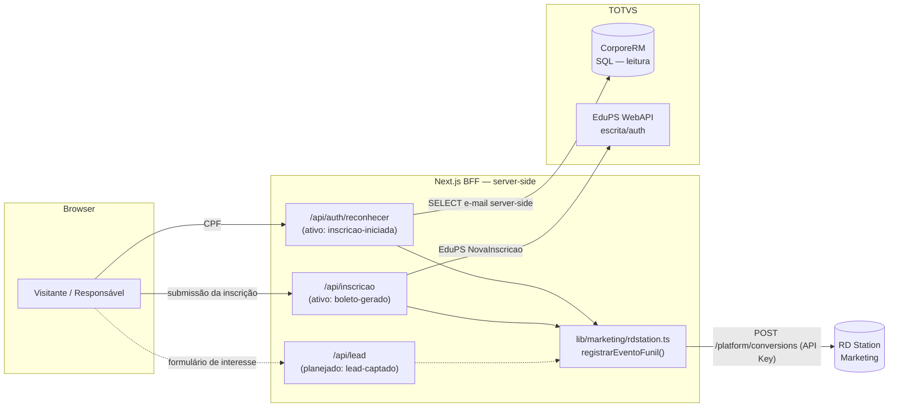
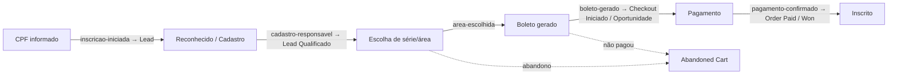

# Integração RD Station — Marketing, CRM e Funil de Inscrição (CSA Leblon 2027)

> Documento de arquitetura e operação da captura de leads e métricas de funil do
> Portal de Inscrições. Cobre a **estratégia**, o **plano técnico em 3 passos**, o
> **mapa de eventos**, as **métricas** e o **passo a passo do que configurar na
> plataforma RD Station**. Escrito para o time técnico e para quem opera o RD.

- **Última atualização:** 2026-06-30
- **Produto-alvo:** RD Station Marketing (núcleo) + RD Station CRM (futuro)
- **Status de implementação:** **Passo 1 parcial.** A lib `registrarEventoFunil()`
  (Conversões via API Key) está pronta e **2 eventos de funil estão ativos**:
  `inscricao-iniciada` (no reconhecimento por CPF) e `boleto-gerado` (na submissão da
  inscrição). O evento de topo `lead-captado` e a rota `POST /api/lead` (formulário de
  interesse) **ainda não existem**. Passos 2 e 3 planejados (OAuth + Events/Contacts/
  Funnels; CRM/Deals).

---

## 1. Por que isto existe (estratégia)

O hotsite **é** o portal de inscrição. Cada visitante que demonstra interesse é um
**lead** que pode (ou não) concluir a inscrição e o pagamento da taxa. O objetivo da
integração é **medir e nutrir todo o percurso** — não apenas "quem clicou em
inscrever", mas **onde cada pessoa parou** e **qual origem traz matrícula**.

Princípios (boas práticas de CRM/marketing aplicadas aqui):

- **Um contato, muitos eventos.** A chave do contato é o **e-mail**; o RD deduplica e
  monta a linha do tempo. Não pensamos em "1 lead = 1 envio", e sim em um contato que
  **acumula eventos** ao longo do funil.
- **Estágios de ciclo de vida.** Visitante → Lead → Lead Qualificado → Oportunidade →
  Cliente. Cada etapa do processo seletivo **promove** o contato.
- **Eventos server-side > pixel no browser.** Disparamos do BFF (Next.js): mais
  confiável (sem adblock), e permite usar dados que o browser não deve ver (ex.: o
  e-mail do responsável já cadastrado, lido do banco do RM).
- **Medir abandono, não só sucesso.** O valor está em saber onde as pessoas param.
- **Atribuição.** UTMs/origem desde o primeiro toque respondem "qual campanha gera
  matrícula", não só clique.
- **LGPD por design.** Consentimento explícito no formulário de interesse; o
  responsável reconhecido já possui relação/base legal com a instituição.

---

## 2. Os dois produtos do RD Station

| Produto | Para quê | API |
| --- | --- | --- |
| **RD Station Marketing** | Captura de lead, nutrição, funil de contato (ciclo de vida), automações | `api.rd.services/platform/*` |
| **RD Station CRM** | Pipeline de negociação (deals) da equipe de admissão/matrícula | CRM v1/v2 (deals, stages, sources) |

Para o funil de inscrição, o **Marketing** é o núcleo. O **CRM** entra quando a equipe
de admissão for trabalhar os leads num pipeline de vendas (Passo 3).

### Autenticação (duas opções)

A própria documentação oficial separa os dois modos por finalidade:

- **API Key (token público)** — endpoint *Conversão via API Key*:
  `POST https://api.rd.services/platform/conversions?api_key=TOKEN`. Segundo a RD, serve
  **exclusivamente para disparar eventos de conversão que criam/atualizam contatos** e é
  a **opção recomendada para integrar formulários e sistemas internos** que transmitem
  conversões. **É o que usamos hoje (Passo 1)** — exatamente o caso de uso indicado.
- **OAuth 2.0** (`client_id`/`client_secret` → `code` → `access_token` +
  `refresh_token`) — exigido para tudo **além** de conversão: disparar **Events**
  (ciclo de vida e e-commerce), **marcar/desmarcar oportunidade** (ganha/perdida),
  **atualizar contatos sem conversão**, consultar **Analytics** e configurar
  **Webhooks**. Migração planejada para o Passo 2 (guardar o `refresh_token`
  server-side e renovar o `access_token` automaticamente).

> **Boas práticas oficiais a observar:** todas as chamadas vão ao domínio base
> `https://api.rd.services` sobre **TLS 1.3**; respeitar os **limites de requisição** da
> API (retry com backoff em 429); a **chave do contato é o e-mail** (a RD deduplica e
> atualiza o mesmo contato a cada conversão — "um contato, muitos eventos").

---

## 3. Arquitetura da integração (visão do sistema)



**Regra de ouro:** o **token do RD nunca vai ao browser**. Todo evento é disparado pelo
BFF. Marketing **nunca bloqueia** a inscrição: falhas só geram log.

---

## 4. O funil mapeado em eventos RD



| Etapa interna (`EtapaFunil`) | Momento no fluxo | Onde dispara hoje | Ciclo de vida RD |
| --- | --- | --- | --- |
| `lead-captado` | Formulário de interesse (LeadModal — Fase 1) | *(planejado — `/api/lead` e o modal ainda não existem)* | Lead |
| `inscricao-iniciada` | CPF reconhecido (fluxo nativo) | ✅ `POST /api/auth/reconhecer` | Lead |
| `cadastro-responsavel` | Dados do responsável confirmados (cadastro novo) | *(planejado — Passo 1.1)* | Lead Qualificado |
| `area-escolhida` | Série/área selecionada | *(planejado — wizard)* | Lead Qualificado |
| `boleto-gerado` | Taxa de inscrição gerada (inscrição concluída) | ✅ `POST /api/inscricao` ¹ | Oportunidade |
| `pagamento-confirmado` | Pagamento da taxa confirmado | *(webhook/retorno — Passo 2)* | Cliente |

¹ Só dispara quando a submissão efetivamente grava no RM — hoje sujeita ao guard
`INSCRICAO_SOMENTE_LEITURA` (enquanto `true`, a rota responde 503 e nenhum evento sai).

Cada evento envia campos de contexto (custom fields): `cf_etapa_funil`,
`cf_ano_processo`, `cf_segmento_interesse`, `cf_idps` e extras por etapa.

---

## 5. Plano técnico em 3 passos

### Passo 1 — Eventos de funil via API Key 🟡 **(parcial)**

- Biblioteca `plataforma/lib/marketing/rdstation.ts` com `registrarEventoFunil()`:
  server-only, não-bloqueante, dedup por e-mail no RD, custom fields `cf_*`. ✅
- `POST /api/auth/reconhecer` dispara `inscricao-iniciada` para responsáveis
  reconhecidos (e-mail real lido do RM, server-side; nunca devolvido ao cliente). ✅
- `POST /api/inscricao` dispara `boleto-gerado` após a inscrição ser gravada no RM
  (com `cf_numero_inscricao` e `cf_valor_taxa`). ✅ *(sujeito ao guard
  `INSCRICAO_SOMENTE_LEITURA`).*
- Variável `RD_ANO_PROCESSO` (padrão `2027`) compõe o `conversion_identifier`. ✅
- **Falta:** criar `POST /api/lead` + o modal de interesse para o evento `lead-captado`
  (rate-limit por IP + consentimento LGPD), e os eventos intermediários do wizard
  (`cadastro-responsavel`, `area-escolhida`). 🔜

### Passo 2 — OAuth + Events/Contacts/Funnels + Webhooks 🔜 **(planejado)**

- Migrar a autenticação de API Key para **OAuth 2.0** (guardar `refresh_token`
  server-side; rotina de renovação).
- Usar **Events** (`POST /platform/events`) para eventos de ciclo de vida e e-commerce
  (*Checkout Iniciado*, *Order Paid*, *Abandoned Cart*).
- Usar **Contacts API** para custom fields ricos e mover o contato no **funil de
  contato** (lifecycle).
- Configurar **webhooks** (MKT/CRM) para o RD nos avisar quando um contato vira
  oportunidade/cliente, cruzando de volta com o nosso banco.

### Passo 3 — RD Station CRM (pipeline de matrícula) 🔜 **(planejado)**

- Espelhar a oportunidade de inscrição como **deal** no CRM, com pipeline/stages da
  equipe de admissão, *sources* (origem) e *lost reasons* (motivos de perda).
- Automação de recuperação: "gerou boleto e não pagou" → lembrete.

---

## 6. Métricas que enriquecem a análise do percurso

Com a evolução (Passos 2/3) passa a ser possível medir:

- **Tempo entre etapas** (CPF → boleto; boleto → pagamento) → gargalos.
- **Taxa de abandono por etapa** (via *Abandoned Cart* / ausência do próximo evento).
- **Reconhecido vs. novo** — conversão de quem já é da base (irmãos/ex-alunos) vs. lead
  frio.
- **Segmento/série com melhor conversão** (1º ano vs. demais séries).
- **Origem/UTM → matrícula** (atribuição real) via *Analytics → estatísticas de funil*.
- **Valor** (taxa de inscrição) nos eventos de e-commerce → receita potencial vs.
  realizada.
- **Multi-candidato** — quantos responsáveis inscrevem mais de um filho
  (`cf_qtd_candidatos`), insight específico do modelo de irmãos do CSA.
- **Cohort por dia/semana** — picos vs. prazo do edital.

---

## 7. O que configurar na plataforma RD Station (passo a passo)

> Necessário para o **Passo 1** já começar a registrar eventos. Itens marcados como
> *(Passo 2/3)* só são preciso quando avançarmos.

### 7.1 Obter o token público (API Key) — **obrigatório agora**

1. Entre no **RD Station Marketing** com um usuário **administrador**.
2. Menu do usuário → **Integrações** (ou **Configurações da conta → Integrações**).
3. Procure por **Token público / API Key** (seção de "Integrações via API" /
   "Conversões"). Copie o **token público**.
4. Cole no `.env.local` do servidor (NUNCA versionar):

   ```bash
   RD_STATION_TOKEN=seu_token_publico_aqui
   RD_ANO_PROCESSO=2027
   ```

5. Em produção, defina a mesma variável no ambiente da VM/serviço Next.js.

> Sem o token, o sistema funciona normalmente: os eventos viram apenas **log**
> (`[rdstation] (stub …)`), sem enviar nada ao RD. Útil para dev.

### 7.2 Criar os campos personalizados (custom fields) — **recomendado agora**

No RD Station, em **Configurações → Campos personalizados**, crie (tipo texto, exceto
onde indicado):

| Campo (API) | Rótulo sugerido | Uso |
| --- | --- | --- |
| `cf_etapa_funil` | Etapa do funil | Etapa atual no percurso |
| `cf_ano_processo` | Ano do processo | Ex.: 2027 |
| `cf_segmento_interesse` | Segmento de interesse | Ex.: fundamental1 |
| `cf_idps` | IDPS (RM) | Id do processo seletivo |
| `cf_responsavel_reconhecido` | Responsável reconhecido | "true" quando já é da base |
| `cf_consentimento_lgpd` | Consentimento LGPD | "true" no formulário de interesse |

> O RD cria campos automaticamente ao receber a conversão, mas criá-los antes garante
> rótulos legíveis e tipos corretos para segmentação/relatórios.

### 7.3 Conferir as conversões chegando

1. Faça uma inscrição/teste no portal (ou preencha o formulário de interesse).
2. No RD, vá em **Conversões** (ou no contato gerado) e confira o
   `conversion_identifier` no padrão `inscricao-2027-<etapa>[-<segmento>]`.
3. Verifique se os custom fields apareceram no contato.

### 7.4 Organizar o funil e automações — **operação contínua**

- **Funil de contato (lifecycle):** em **Configurações → Funil de marketing**, associe
  os identificadores de conversão aos estágios (Lead, Lead Qualificado, Oportunidade,
  Cliente) conforme a tabela da seção 4.
- **Segmentações:** crie listas por `cf_segmento_interesse`, `cf_etapa_funil`,
  `cf_responsavel_reconhecido` para campanhas dirigidas.
- **Automação de recuperação:** fluxo para quem chegou a `boleto-gerado` mas não a
  `pagamento-confirmado` (lembrete da taxa).

### 7.5 *(Passo 2)* Aplicação OAuth e Webhooks

- Em **Integrações → Apps / OAuth**, crie uma aplicação para obter
  `client_id`/`client_secret` e configurar `redirect_uri`. Guarde o `refresh_token`
  server-side.
- Configure **Webhooks** para os eventos de marcação de oportunidade/cliente apontando
  para um endpoint do nosso BFF (a criar).

### 7.6 *(Passo 3)* RD Station CRM — token e negociações (deals)

> **Sim, o CRM precisa de um token próprio** — **diferente** do token do Marketing
> (`RD_STATION_TOKEN`). São dois produtos e duas credenciais.

**O CRM tem duas APIs:**

| API | Base | Autenticação | Quando usar |
| --- | --- | --- | --- |
| **v1** (recomendada para começar) | `https://crm.rdstation.com/api/v1/` | **Token de instância** via querystring `?token=...` | Integração simples servidor↔servidor (igual à API Key do Marketing) |
| **v2** | `https://api.rd.services/crm/v2/` | **OAuth 2.0** (app + `access_token`/`refresh_token`) | Quando precisar de OAuth/escopos e endpoints mais novos |

**Como obter o token de instância (v1):**

> O token do CRM **não fica** em "Configurações → Integrações". No RD Station CRM
> ele é o **Token da instância**, **por usuário** (cada usuário tem um token único
> e imutável), e fica no **Perfil** do usuário.

1. Entre no **RD Station CRM** (use um usuário com **visibilidade Geral**, para
   conseguir criar/listar negociações de toda a equipe).
2. Clique no seu **nome de usuário** (canto superior direito da página).
3. No menu suspenso, clique em **Perfil**
   (atalho direto: `https://plugcrm.net/app#/settings/profile`).
4. Se já existir, o código aparece no campo **Token da instância** — é só copiar.
   Se não existir, clique em **Gerar Token** e copie o código.
5. Cole no `.env.local` do servidor (NUNCA versionar):

   ```bash
   RD_CRM_TOKEN=seu_token_da_instancia_aqui
   # Opcional: etapa inicial do funil de admissão (ID em CRM → Funis de venda).
   # Sem ela, a negociação cai no funil padrão.
   RD_CRM_DEAL_STAGE_ID=id_da_etapa_inicial
   ```

6. Em produção, defina as mesmas variáveis no ambiente da VM/serviço Next.js.

> **Quem pode gerar token:** em **nome do usuário → Configurações → Preferências →
> aba Token de API**, um administrador define se apenas administradores ou todos
> os usuários podem gerar tokens. **Atenção:** *Desativar/Gerar token* novamente
> invalida (irreversivelmente) as integrações que usavam o token anterior.

> Sem `RD_CRM_TOKEN`, o sistema funciona normalmente: a negociação vira apenas
> **log** (`[rdcrm] (stub …)`), sem enviar nada ao CRM. Útil para dev.

**O que o sistema já faz:** ao gerar a taxa de inscrição (`boleto-gerado`), o BFF
cria de forma **não-bloqueante** uma **negociação** no CRM
(`POST /api/v1/deals?token=...`) com o nome `Inscrição nº <n> — <candidato>`,
o **contato** do responsável (nome/e-mail/telefone), o **valor** da taxa e a
**fonte** "Portal de Inscrição". A operação de leitura/escrita no RM nunca é
afetada por falhas do CRM.

**Configuração recomendada no CRM (operação):** defina **pipeline** e **stages**
de admissão (ex.: *Inscrito → Documentação → Prova/Entrevista → Matriculado*),
**sources** (origens) e **lost reasons** (motivos de perda). Use o
`RD_CRM_DEAL_STAGE_ID` para que toda inscrição entre já na etapa inicial certa.

### 7.7 Atribuição de origem (Social, Orgânico, Pago…) — **código de rastreamento**

Para detectar com confiança **de onde** o visitante chegou (incluindo redes
sociais), a forma estável é deixar o **RD classificar** a origem:

1. **Código de rastreamento na página.** Em **RD Station Marketing →
   Configurações → Conta → Script do RD Station**, copie o *loader* da conta
   (formato `…/loader-scripts/<UUID>-loader.js`) e informe só o **UUID** no
   ambiente:

   ```bash
   NEXT_PUBLIC_RD_TRACKING_UUID=uuid-da-sua-conta
   ```

   O `layout.tsx` injeta o script automaticamente quando a variável existe. Ele
   grava o cookie `__trf.src` com a atribuição de **primeiro e último toque**.

2. **Ponte servidor↔navegador.** No BFF, os eventos de funil (`inscricao-iniciada`,
   `boleto-gerado`) leem o cookie `__trf.src` e o enviam como
   **`client_tracking_id`** na conversão. Assim o RD amarra o evento server-side
   à sessão do navegador e aplica a origem correta — **sem reimplementarmos** a
   classificação. UTMs (`utm_source/medium/campaign`) são enviados como reforço
   opcional quando presentes.

> Sem `NEXT_PUBLIC_RD_TRACKING_UUID`, nada é carregado no browser e os eventos
> seguem funcionando (apenas sem o `client_tracking_id`/atribuição fina).

---

## 8. Referência de implementação (arquivos)

| Arquivo | Papel |
| --- | --- |
| `plataforma/lib/marketing/rdstation.ts` | Lib server-only; `registrarEventoFunil()`, tipo `EtapaFunil`, custom fields, `client_tracking_id`/`traffic_*` |
| `plataforma/lib/marketing/origem.ts` | `extrairOrigem(req)` — lê cookie `__trf.src` + UTMs para atribuição |
| `plataforma/lib/marketing/rdcrm.ts` | Lib server-only; `registrarNegociacaoInscricao()` — cria deal no CRM (v1) |
| `plataforma/app/layout.tsx` | Injeta o código de rastreamento do RD (env `NEXT_PUBLIC_RD_TRACKING_UUID`) |
| `plataforma/app/api/auth/reconhecer/route.ts` | BFF — evento `inscricao-iniciada` para responsável reconhecido |
| `plataforma/app/api/inscricao/route.ts` | BFF — evento `boleto-gerado` + negociação no CRM após gravar a inscrição |
| `plataforma/lib/totvs/queries.ts` | `reconhecerResponsavelPorCpf()` expõe `email` bruto **server-side** (nunca ao cliente) |
| `plataforma/.env.local` | `RD_STATION_TOKEN`, `RD_ANO_PROCESSO`, `RD_CRM_TOKEN`, `RD_CRM_DEAL_STAGE_ID`, `NEXT_PUBLIC_RD_TRACKING_UUID` |
| `plataforma/app/api/lead/route.ts` | *(a criar)* BFF público — evento `lead-captado` (formulário de interesse), rate-limit + LGPD |

### Contrato de `registrarEventoFunil`

```ts
registrarEventoFunil({
  etapa: "inscricao-iniciada", // EtapaFunil
  email: "responsavel@exemplo.com", // chave do contato no RD
  nome?: "Maria",
  telefone?: "+5521999999999",
  segmento?: "fundamental1",
  idps?: 210,
  camposExtras?: { cf_qualquer_campo: "valor" }, // recebe prefixo cf_ se faltar
});
// Nunca lança. Sem RD_STATION_TOKEN → apenas log (stub). Sem e-mail → ignora.
```

---

## 9. Segurança e LGPD (resumo)

- **Token só no servidor.** `RD_STATION_TOKEN` e `RD_CRM_TOKEN` vivem no
  `.env.local`/ambiente; nunca no bundle do cliente. As libs são `server-only`.
  (Apenas `NEXT_PUBLIC_RD_TRACKING_UUID` é público por natureza — é o id do
  script de rastreamento que roda no navegador.)
- **E-mail completo nunca vai ao cliente.** O reconhecimento devolve só
  `emailMascarado`; o e-mail bruto é usado apenas no servidor para o evento de funil.
- **Consentimento.** O formulário de interesse exige consentimento explícito
  (`cf_consentimento_lgpd`). O responsável reconhecido já tem relação com a
  instituição (base legal de execução/legítimo interesse no processo de matrícula).
- **Marketing nunca bloqueia.** Qualquer falha do RD é tolerada e apenas logada.
- **Rate-limit** nas rotas de captura para conter abuso/enumeração.
