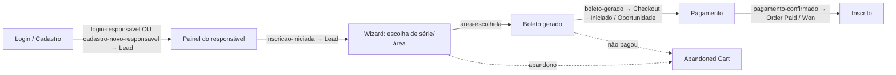

# Integração RD Station — Marketing, CRM e Funil de Inscrição (CSA Leblon 2027)

> Documento de arquitetura e operação da captura de leads e métricas de funil do
> Portal de Inscrições. Cobre a **estratégia**, o **plano técnico em 3 passos**, o
> **mapa de eventos**, as **métricas** e o **passo a passo do que configurar na
> plataforma RD Station**. Escrito para o time técnico e para quem opera o RD.

- **Última atualização:** 2026-07-06
- **Produto-alvo:** RD Station Marketing (núcleo) + RD Station CRM (negociações)
- **Status de implementação:** **Passo 1 ativo + CRM (deals) ativo.** A lib
  `registrarEventoFunil()` (Conversões via API Key) está pronta e **4 eventos de funil
  estão ativos**: `login-responsavel` (responsável já cadastrado autentica — 1x por
  sessão), `cadastro-novo-responsavel` (novo responsável cria conta na 1ª inscrição),
  `inscricao-iniciada` (responsável clica em "incluir candidato" e inicia o wizard) e
  `boleto-gerado` (inscrição concluída, com contexto enriquecido — candidato, processo,
  relação, responsável financeiro e valor da taxa). Os dois primeiros **diferenciam quem
  retorna (login) de quem se cadastra pela 1ª vez**. A lib `registrarNegociacaoInscricao()`
  **cria a negociação (deal) no RD Station CRM** a cada `boleto-gerado`, com contatos, valor
  (produto) e **campos personalizados** de curso/série/relação/IDLAN. O evento de topo
  `lead-captado` e a rota `POST /api/lead` (formulário de interesse) **ainda não existem**.
  O evento de **abandono** ainda não é rastreado. Passo 2 (OAuth +
  Events/Contacts/Funnels/Webhooks) planejado; marcar o deal como ganho/pago no pagamento
  da taxa ainda **não** está implementado.

---

## 1. Por que isto existe (estratégia)

O hotsite **é** o portal de inscrição. Cada visitante que demonstra interesse é um
**lead** que pode (ou não) concluir a inscrição e o pagamento da taxa. O objetivo da
integração é **medir e nutrir todo o percurso** — não apenas "quem clicou em
inscrever", mas **onde cada pessoa parou** e **qual origem traz matrícula**.

Princípios (boas práticas de CRM/marketing aplicadas aqui):

- **Um contato, muitos eventos.** A chave do contato é o **e-mail**; o RD deduplica e
  monta a linha do tempo. Não pensamos em "1 lead = 1 envio", e sim em um contato que
  **acumula eventos** ao longo do funil.
- **Estágios de ciclo de vida.** Visitante → Lead → Lead Qualificado → Oportunidade →
  Cliente. Cada etapa do processo seletivo **promove** o contato.
- **Eventos server-side > pixel no browser.** Disparamos do BFF (Next.js): mais
  confiável (sem adblock), e permite usar dados que o browser não deve ver (ex.: o
  e-mail do responsável já cadastrado, lido do banco do RM).
- **Medir abandono, não só sucesso.** O valor está em saber onde as pessoas param.
- **Atribuição.** UTMs/origem desde o primeiro toque respondem "qual campanha gera
  matrícula", não só clique.
- **LGPD por design.** Consentimento explícito no formulário de interesse; o
  responsável reconhecido já possui relação/base legal com a instituição.

---

## 2. Os dois produtos do RD Station

| Produto | Para quê | API |
| --- | --- | --- |
| **RD Station Marketing** | Captura de lead, nutrição, funil de contato (ciclo de vida), automações | `api.rd.services/platform/*` |
| **RD Station CRM** | Pipeline de negociação (deals) da equipe de admissão/matrícula | CRM v1/v2 (deals, stages, sources) |

Para o funil de inscrição, o **Marketing** é o núcleo. O **CRM** entra quando a equipe
de admissão for trabalhar os leads num pipeline de vendas (Passo 3).

### Autenticação (duas opções)

A própria documentação oficial separa os dois modos por finalidade:

- **API Key (token público)** — endpoint *Conversão via API Key*:
  `POST https://api.rd.services/platform/conversions?api_key=TOKEN`. Segundo a RD, serve
  **exclusivamente para disparar eventos de conversão que criam/atualizam contatos** e é
  a **opção recomendada para integrar formulários e sistemas internos** que transmitem
  conversões. **É o que usamos hoje (Passo 1)** — exatamente o caso de uso indicado.
- **OAuth 2.0** (`client_id`/`client_secret` → `code` → `access_token` +
  `refresh_token`) — exigido para tudo **além** de conversão: disparar **Events**
  (ciclo de vida e e-commerce), **marcar/desmarcar oportunidade** (ganha/perdida),
  **atualizar contatos sem conversão**, consultar **Analytics** e configurar
  **Webhooks**. Migração planejada para o Passo 2 (guardar o `refresh_token`
  server-side e renovar o `access_token` automaticamente).

> **Boas práticas oficiais a observar:** todas as chamadas vão ao domínio base
> `https://api.rd.services` sobre **TLS 1.3**; respeitar os **limites de requisição** da
> API (retry com backoff em 429); a **chave do contato é o e-mail** (a RD deduplica e
> atualiza o mesmo contato a cada conversão — "um contato, muitos eventos").

---

## 3. Arquitetura da integração (visão do sistema)

```mermaid
flowchart LR
    subgraph Browser
        U[Visitante / Responsável]
    end
    subgraph BFF[Next.js BFF — server-side]
        A2["/api/auth/login<br/>(ativo: login-responsavel)"]
        M["/api/marketing/inscricao-iniciada<br/>(ativo: inscricao-iniciada)"]
        I["/api/inscricao<br/>(ativo: cadastro-novo-responsavel + boleto-gerado)"]
        L["/api/lead<br/>(planejado: lead-captado)"]
        F["lib/marketing/rdstation.ts<br/>registrarEventoFunil()"]
    end
    subgraph TOTVS
        DB[(CorporeRM<br/>SQL — leitura)]
        EDU[EduPS WebAPI<br/>escrita/auth]
    end
    RD[(RD Station<br/>Marketing)]

    U -->|login| A2
    U -->|clica "incluir candidato"| M
    U -->|submissão da inscrição| I
    U -.->|formulário de interesse| L
    A2 -->|SELECT e-mail server-side| DB
    M -->|e-mail pela sessão| DB
    I -->|EduPS NovaInscricao| EDU
    A2 --> F
    M --> F
    I --> F
    L -.-> F
    F -->|"POST /platform/conversions (API Key)"| RD
```

**Regra de ouro:** o **token do RD nunca vai ao browser**. Todo evento é disparado pelo
BFF. Marketing **nunca bloqueia** a inscrição: falhas só geram log.

---

## 4. O funil mapeado em eventos RD



| Etapa interna (`EtapaFunil`) | Momento no fluxo | Onde dispara hoje | Ciclo de vida RD |
| --- | --- | --- | --- |
| `lead-captado` | Formulário de interesse (LeadModal — Fase 1) | *(planejado — `/api/lead` e o modal ainda não existem)* | Lead |
| `login-responsavel` | Responsável JÁ CADASTRADO autentica (1x por sessão) | ✅ `POST /api/auth/login` | Lead |
| `cadastro-novo-responsavel` | NOVO responsável cria conta (1ª inscrição) | ✅ `POST /api/inscricao` (fluxo novo) | Lead |
| `inscricao-iniciada` | Clica em "incluir candidato" (inicia o wizard) | ✅ `POST /api/marketing/inscricao-iniciada` (beacon, sessão) | Lead Qualificado |
| `area-escolhida` | Série/área selecionada | *(planejado — wizard)* | Lead Qualificado |
| `boleto-gerado` | Taxa de inscrição gerada (inscrição concluída) | ✅ `POST /api/inscricao` ¹ | Oportunidade |
| `pagamento-confirmado` | Pagamento da taxa confirmado | *(webhook/retorno — Passo 2)* | Cliente |

¹ Só dispara quando a submissão efetivamente grava no RM — hoje sujeita ao guard
`INSCRICAO_SOMENTE_LEITURA` (enquanto `true`, a rota responde 503 e nenhum evento sai).

Cada evento envia campos de contexto (custom fields): `cf_etapa_funil`,
`cf_ano_processo`, `cf_segmento_interesse`, `cf_idps` e extras por etapa. O
`boleto-gerado`, por ser o evento de maior valor, envia ainda: `cf_numero_inscricao`,
`cf_valor_taxa`, `cf_nome_candidato`, `cf_processo_seletivo`, `cf_relacao_responsavel`,
`cf_responsavel_financeiro_distinto` e — quando o responsável financeiro é outra pessoa —
`cf_nome_responsavel_financeiro`, `cf_email_responsavel_financeiro` e
`cf_telefone_responsavel_financeiro`.

---

## 5. Plano técnico em 3 passos

### Passo 1 — Eventos de funil via API Key 🟡 **(parcial)**

- Biblioteca `plataforma/lib/marketing/rdstation.ts` com `registrarEventoFunil()`:
  server-only, não-bloqueante, dedup por e-mail no RD, custom fields `cf_*`. ✅
- `POST /api/auth/login` dispara `login-responsavel` quando um responsável JÁ
  CADASTRADO autentica com sucesso (e-mail real lido do RM, server-side; 1x por sessão,
  pois cada login cria uma sessão nova). ✅
- `POST /api/inscricao` (fluxo novo) dispara `cadastro-novo-responsavel` após criar a
  conta do responsável na 1ª inscrição — diferencia, no RD, quem se cadastra pela 1ª vez
  de quem retorna. ✅
- `POST /api/marketing/inscricao-iniciada` (beacon do painel) dispara `inscricao-iniciada`
  quando o responsável clica em "incluir candidato". O e-mail vem da SESSÃO (nunca do
  cliente); best-effort e não-bloqueante. ✅
- `POST /api/inscricao` dispara `boleto-gerado` após a inscrição ser gravada no RM
  (com contexto enriquecido: `cf_numero_inscricao`, `cf_valor_taxa`, `cf_nome_candidato`,
  `cf_processo_seletivo`, `cf_relacao_responsavel` e dados do responsável financeiro).
  ✅ *(sujeito ao guard `INSCRICAO_SOMENTE_LEITURA`).*
- Variável `RD_ANO_PROCESSO` (padrão `2027`) compõe o `conversion_identifier`. ✅
- **Falta:** criar `POST /api/lead` + o modal de interesse para o evento `lead-captado`
  (rate-limit por IP + consentimento LGPD), o evento intermediário `area-escolhida` do
  wizard e o rastreio de **abandono**. 🔜

### Passo 2 — OAuth + Events/Contacts/Funnels + Webhooks 🔜 **(planejado)**

- Migrar a autenticação de API Key para **OAuth 2.0** (guardar `refresh_token`
  server-side; rotina de renovação).
- Usar **Events** (`POST /platform/events`) para eventos de ciclo de vida e e-commerce
  (*Checkout Iniciado*, *Order Paid*, *Abandoned Cart*).
- Usar **Contacts API** para custom fields ricos e mover o contato no **funil de
  contato** (lifecycle).
- Configurar **webhooks** (MKT/CRM) para o RD nos avisar quando um contato vira
  oportunidade/cliente, cruzando de volta com o nosso banco.

### Passo 3 — RD Station CRM (pipeline de matrícula) � **(ativo, parcial)**

- Espelha a oportunidade de inscrição como **deal** no CRM (`registrarNegociacaoInscricao()`),
  disparado no `boleto-gerado`: contatos (responsável + responsável financeiro), valor da
  taxa como produto, `deal_source` e campos personalizados (curso/série/relação/IDLAN). ✅
- **Falta:** mover o deal para "pago/ganho" quando a taxa é baixada (reconciliação via
  `RD_CRM_CF_IDLAN_ID`) e configurar automações de recuperação ("gerou boleto e não
  pagou" → lembrete). 🔜

---

## 6. Métricas que enriquecem a análise do percurso

Com a evolução (Passos 2/3) passa a ser possível medir:

- **Tempo entre etapas** (CPF → boleto; boleto → pagamento) → gargalos.
- **Taxa de abandono por etapa** (via *Abandoned Cart* / ausência do próximo evento).
- **Reconhecido vs. novo** — conversão de quem já é da base (irmãos/ex-alunos) vs. lead
  frio.
- **Segmento/série com melhor conversão** (1º ano vs. demais séries).
- **Origem/UTM → matrícula** (atribuição real) via *Analytics → estatísticas de funil*.
- **Valor** (taxa de inscrição) nos eventos de e-commerce → receita potencial vs.
  realizada.
- **Multi-candidato** — quantos responsáveis inscrevem mais de um filho
  (`cf_qtd_candidatos`), insight específico do modelo de irmãos do CSA.
- **Cohort por dia/semana** — picos vs. prazo do edital.

---

## 7. O que configurar na plataforma RD Station (passo a passo)

> Necessário para o **Passo 1** já começar a registrar eventos. Itens marcados como
> *(Passo 2/3)* só são preciso quando avançarmos.

### 7.1 Obter o token público (API Key) — **obrigatório agora**

1. Entre no **RD Station Marketing** com um usuário **administrador**.
2. Menu do usuário → **Integrações** (ou **Configurações da conta → Integrações**).
3. Procure por **Token público / API Key** (seção de "Integrações via API" /
   "Conversões"). Copie o **token público**.
4. Cole no `.env.local` do servidor (NUNCA versionar):

   ```bash
   RD_STATION_TOKEN=seu_token_publico_aqui
   RD_ANO_PROCESSO=2027
   ```

5. Em produção, defina a mesma variável no ambiente da VM/serviço Next.js.

> Sem o token, o sistema funciona normalmente: os eventos viram apenas **log**
> (`[rdstation] (stub …)`), sem enviar nada ao RD. Útil para dev.

### 7.2 Criar os campos personalizados (custom fields) — **recomendado agora**

No RD Station, em **Configurações → Campos personalizados**, crie (tipo texto, exceto
onde indicado):

| Campo (API) | Rótulo sugerido | Uso |
| --- | --- | --- |
| `cf_etapa_funil` | Etapa do funil | Etapa atual no percurso |
| `cf_ano_processo` | Ano do processo | Ex.: 2027 |
| `cf_segmento_interesse` | Segmento de interesse | Ex.: fundamental1 |
| `cf_idps` | IDPS (RM) | Id do processo seletivo |
| `cf_responsavel_reconhecido` | Responsável reconhecido | "true" quando já é da base |
| `cf_consentimento_lgpd` | Consentimento LGPD | "true" no formulário de interesse |
| `cf_numero_inscricao` | Nº da inscrição | Enviado no `boleto-gerado` |
| `cf_valor_taxa` | Valor da taxa | Valor da taxa de inscrição |
| `cf_nome_candidato` | Nome do candidato | Candidato inscrito |
| `cf_processo_seletivo` | Processo seletivo | Nome do PS (curso/ano-série) |
| `cf_relacao_responsavel` | Relação do responsável | pai / mãe / outro |
| `cf_responsavel_financeiro_distinto` | Resp. financeiro distinto | "sim"/"nao" |
| `cf_nome_responsavel_financeiro` | Nome do resp. financeiro | Quando é outra pessoa |
| `cf_email_responsavel_financeiro` | E-mail do resp. financeiro | Quando é outra pessoa |
| `cf_telefone_responsavel_financeiro` | Telefone do resp. financeiro | Quando é outra pessoa |

> **Auto-criação — a diferença entre os dois produtos:**
> - **Marketing:** os campos `cf_*` são **criados automaticamente** pela API ao receber a
>   conversão (não usam ID). Pré-criar é **opcional** e serve só para qualidade: sem isso,
>   o **rótulo** nasce igual ao identificador técnico (`cf_valor_taxa`) e o **tipo** nasce
>   sempre como **texto** (para tratar `cf_valor_taxa`/`cf_age` como número/moeda em
>   relatórios, crie/ajuste o tipo antes).
> - **CRM:** é diferente — os campos personalizados **NÃO são auto-criados**. A API v1
>   exige um **UUID pré-cadastrado**; sem ele, o campo é **silenciosamente ignorado**
>   (ver §7.6). Portanto os campos do CRM **precisam ser criados manualmente**.

**Reaproveitar campos que já existem na conta.** A conta do CSA já possui campos padrão;
sempre que fizer sentido, **mapeamos nossos dados para eles** em vez de criar duplicatas:

| Campo existente (API) | Como usar | Origem no nosso fluxo |
| --- | --- | --- |
| `cf_course_of_interest` | Curso/série de interesse | Nome do PS (`cf_processo_seletivo`) — **enviado no `boleto-gerado`** |
| `cf_interest_in_courses` | Interesse em cursos (lista) | Idem, quando houver múltiplos candidatos |
| `cf_schooling` | Escolaridade | *(não temos hoje — só se um formulário coletar)* |
| `cf_age` | Idade do candidato | *(não temos hoje — poderia derivar da data de nascimento)* |
| `cf_educational_motivation` / `cf_professional_training` | Motivação / formação | *(não temos hoje — campos de formulário de interesse futuro)* |

> **NÃO escrever nos campos `cf_plug_*`** (`cf_plug_funnel_stage`, `cf_plug_deal_pipeline`,
> `cf_plug_lost_reason`, `cf_plug_contact_owner`, `cf_plug_opportunity_origin`,
> `cf_plug_opportunity_score`, `cf_plug_opportunity_value`). Eles são **preenchidos
> automaticamente pela sincronização nativa CRM → Marketing** ("Plug"): refletem a
> etapa/funil/valor/origem/qualificação da negociação **no CRM**. Escrever neles por API
> causaria conflito com o que o próprio RD sincroniza. Ou seja, ao criarmos o deal no CRM
> (§7.6), esses campos do contato **passam a ser alimentados sozinhos** — é justamente o
> que queremos.

> O RD cria campos automaticamente ao receber a conversão, mas criá-los antes garante
> rótulos legíveis e tipos corretos para segmentação/relatórios.

### 7.3 Conferir as conversões chegando

1. Faça uma inscrição/teste no portal (ou preencha o formulário de interesse).
2. No RD, vá em **Conversões** (ou no contato gerado) e confira o
   `conversion_identifier` no padrão `inscricao-2027-<etapa>[-<segmento>]`.
3. Verifique se os custom fields apareceram no contato.

### 7.4 Organizar o funil e automações — **operação contínua**

- **Funil de contato (lifecycle):** em **Configurações → Funil de marketing**, associe
  os identificadores de conversão aos estágios (Lead, Lead Qualificado, Oportunidade,
  Cliente) conforme a tabela da seção 4.
- **Segmentações:** crie listas por `cf_segmento_interesse`, `cf_etapa_funil`,
  `cf_responsavel_reconhecido` para campanhas dirigidas.
- **Automação de recuperação:** fluxo para quem chegou a `boleto-gerado` mas não a
  `pagamento-confirmado` (lembrete da taxa).

### 7.5 *(Passo 2)* Aplicação OAuth e Webhooks

- Em **Integrações → Apps / OAuth**, crie uma aplicação para obter
  `client_id`/`client_secret` e configurar `redirect_uri`. Guarde o `refresh_token`
  server-side.
- Configure **Webhooks** para os eventos de marcação de oportunidade/cliente apontando
  para um endpoint do nosso BFF (a criar).

### 7.6 *(Passo 3)* RD Station CRM — token e negociações (deals)

> **Sim, o CRM precisa de um token próprio** — **diferente** do token do Marketing
> (`RD_STATION_TOKEN`). São dois produtos e duas credenciais.

**O CRM tem duas APIs:**

| API | Base | Autenticação | Quando usar |
| --- | --- | --- | --- |
| **v1** (recomendada para começar) | `https://crm.rdstation.com/api/v1/` | **Token de instância** via querystring `?token=...` | Integração simples servidor↔servidor (igual à API Key do Marketing) |
| **v2** | `https://api.rd.services/crm/v2/` | **OAuth 2.0** (app + `access_token`/`refresh_token`) | Quando precisar de OAuth/escopos e endpoints mais novos |

**Como obter o token de instância (v1):**

> O token do CRM **não fica** em "Configurações → Integrações". No RD Station CRM
> ele é o **Token da instância**, **por usuário** (cada usuário tem um token único
> e imutável), e fica no **Perfil** do usuário.

1. Entre no **RD Station CRM** (use um usuário com **visibilidade Geral**, para
   conseguir criar/listar negociações de toda a equipe).
2. Clique no seu **nome de usuário** (canto superior direito da página).
3. No menu suspenso, clique em **Perfil**
   (atalho direto: `https://plugcrm.net/app#/settings/profile`).
4. Se já existir, o código aparece no campo **Token da instância** — é só copiar.
   Se não existir, clique em **Gerar Token** e copie o código.
5. Cole no `.env.local` do servidor (NUNCA versionar):

   ```bash
   RD_CRM_TOKEN=seu_token_da_instancia_aqui
   # Opcional: etapa inicial do funil de admissão (ID em CRM → Funis de venda).
   # Sem ela, a negociação cai no funil padrão.
   RD_CRM_DEAL_STAGE_ID=id_da_etapa_inicial
   ```

6. Em produção, defina as mesmas variáveis no ambiente da VM/serviço Next.js.

> **Quem pode gerar token:** em **nome do usuário → Configurações → Preferências →
> aba Token de API**, um administrador define se apenas administradores ou todos
> os usuários podem gerar tokens. **Atenção:** *Desativar/Gerar token* novamente
> invalida (irreversivelmente) as integrações que usavam o token anterior.

> Sem `RD_CRM_TOKEN`, o sistema funciona normalmente: a negociação vira apenas
> **log** (`[rdcrm] (stub …)`), sem enviar nada ao CRM. Útil para dev.

**Mapeamento nos campos padrão da NEGOCIAÇÃO (decisão atual).** Para evitar campos
personalizados (que na API v1 exigem UUID pré-cadastrado), usamos apenas os **campos
padrão** do deal. O mapeamento é:

| Dado do portal | Campo padrão do CRM | Observação |
| --- | --- | --- |
| Nº da inscrição + candidato | **Nome do negócio** | `Inscrição nº <n> — <candidato>`; o **nº da inscrição** é a chave de reconciliação (busca por nome) |
| Origem (Social/Orgânico/Pago) | **Fonte** (`deal_source`) | auto-criada pelo nome; ver §7.8 |
| Processo seletivo + série | **Campanha** (`campaign`) | texto livre, ex.: `Fund. I 2027 — 1º ano` |
| Valor da taxa | **Valor único** (`amount_unique`) | preenchido pela taxa lançada como **produto** (recorrência única) |
| Funil de admissão | **Funil** (`pipeline`) | `RD_CRM_DEAL_STAGE_ID` define a etapa inicial |
| Etapa | **Etapa do funil** (`deal_stage`) | Inscrito → Taxa paga → Documentação → Prova → Matriculado |
| Prazo do PS (opcional) | **Previsão de fechamento** (`prediction_date`) | data limite da inscrição |
| Temperatura (opcional) | **Qualificação** (`rating`) | ex.: elevar após boleto gerado |

**O que continua fora de campo (vai nos contatos):**

- **Relação do responsável** (pai/mãe/outro): sufixo no nome do contato — `Fulano (pai)`.
- **Responsável financeiro distinto** e seu **nome**: entra como **2º contato** do deal
  (`… (responsável financeiro)`).

> **Reconciliação de pagamento sem custom field:** como não há mais o campo `IDLAN`, a
> baixa da taxa passa a casar pelo **número da inscrição** que já vai no **nome do
> negócio**. O job de conciliação (FLAN pago no RM) mapeia `IDLAN → nº da inscrição` e
> localiza o deal via **busca por nome** (`GET /deals?name=Inscrição nº <n>`), movendo-o
> para a etapa "Taxa paga". É a base do Passo de atualização de pagamento (ainda não
> implementado).

**O que o sistema já faz:** ao gerar a taxa de inscrição (`boleto-gerado`), o BFF
cria de forma **não-bloqueante** uma **negociação** (`POST /api/v1/deals?token=...`):

- **Nome:** `Inscrição nº <n> — <candidato>`.
- **Contatos:** o responsável pela inscrição (nome com a relação, e-mail, telefone) e,
  quando há **responsável financeiro distinto**, ele entra como **2º contato**
  (`… (responsável financeiro)`) — visível no CRM sem depender de campo personalizado.
- **Valor:** a taxa é registrada como **produto** (`deal_products` → "Taxa de inscrição").
  Na API v1 o `amount_total` do deal é **calculado a partir dos produtos** — enviar
  `amount_total` direto no deal seria ignorado.
- **Fonte (`deal_source`):** ver §7.8 (mapeamento de origem).
- **Campanha (`campaign`):** processo seletivo + série (texto livre).
- **Etapa/funil:** `RD_CRM_DEAL_STAGE_ID` (etapa inicial), depois movida na conciliação.

A operação de leitura/escrita no RM nunca é afetada por falhas do CRM.

**Configuração recomendada no CRM (operação):** defina **pipeline** e **stages**
de admissão (ex.: *Inscrito → Documentação → Prova/Entrevista → Matriculado*),
**sources** (origens) e **lost reasons** (motivos de perda). Use o
`RD_CRM_DEAL_STAGE_ID` para que toda inscrição entre já na etapa inicial certa.

### 7.7 Atribuição de origem (Social, Orgânico, Pago…) — **código de rastreamento**

Para detectar com confiança **de onde** o visitante chegou (incluindo redes
sociais), a forma estável é deixar o **RD classificar** a origem:

1. **Código de rastreamento na página.** Em **RD Station Marketing →
   Configurações → Conta → Script do RD Station**, copie o *loader* da conta
   (formato `…/loader-scripts/<UUID>-loader.js`) e informe só o **UUID** no
   ambiente:

   ```bash
   NEXT_PUBLIC_RD_TRACKING_UUID=uuid-da-sua-conta
   ```

   O `layout.tsx` injeta o script automaticamente quando a variável existe. Ele
   grava o cookie `__trf.src` com a atribuição de **primeiro e último toque**.

2. **Ponte servidor↔navegador.** No BFF, os eventos de funil (`inscricao-iniciada`,
   `boleto-gerado`) leem o cookie `__trf.src` e o enviam como
   **`client_tracking_id`** na conversão. Assim o RD amarra o evento server-side
   à sessão do navegador e aplica a origem correta — **sem reimplementarmos** a
   classificação. UTMs (`utm_source/medium/campaign`) são enviados como reforço
   opcional quando presentes.

> Sem `NEXT_PUBLIC_RD_TRACKING_UUID`, nada é carregado no browser e os eventos
> seguem funcionando (apenas sem o `client_tracking_id`/atribuição fina).

### 7.8 Fonte padrão (`source`) — fallback consistente entre Marketing e CRM

O código de rastreamento (§7.7) cobre a origem **real** (Social, Orgânico, Pago…).
Quando ela **não existe** (visitante sem cookie `__trf.src` e sem UTM), evitamos que o
RD registre a origem como `unknown` aplicando uma **fonte padrão** — a mesma nos dois
produtos, para o `source` ficar consistente:

- **Marketing** (`rdstation.ts`): a fonte padrão vira `traffic_source` da conversão,
  **apenas como fallback** (nunca sobrepõe o `client_tracking_id`/UTM reais).
- **CRM** (`rdcrm.ts`): a mesma string vira o `deal_source.name` da negociação (o CRM
  cria a *source* automaticamente pelo nome, se ainda não existir).

Controle por ambiente (opcional — o padrão embutido é `"Portal de Inscrição"`):

```bash
# Fonte/"source" padrão exibida no RD quando não há origem real (Marketing + CRM).
RD_SOURCE_PADRAO=Portal de Inscrição
```

> Mapa resumido do `source`: origem real (cookie/UTM) **tem prioridade**; na ausência
> dela, usa-se `RD_SOURCE_PADRAO` → `traffic_source` (Marketing) e `deal_source.name`
> (CRM). Assim relatórios de origem não ficam poluídos com "unknown".

---

## 8. Referência de implementação (arquivos)

| Arquivo | Papel |
| --- | --- |
| `plataforma/lib/marketing/rdstation.ts` | Lib server-only; `registrarEventoFunil()`, tipo `EtapaFunil`, custom fields, `client_tracking_id`/`traffic_*` |
| `plataforma/lib/marketing/origem.ts` | `extrairOrigem(req)` — lê cookie `__trf.src` + UTMs para atribuição |
| `plataforma/lib/marketing/rdcrm.ts` | Lib server-only; `registrarNegociacaoInscricao()` — cria deal no CRM (v1) |
| `plataforma/app/layout.tsx` | Injeta o código de rastreamento do RD (env `NEXT_PUBLIC_RD_TRACKING_UUID`) |
| `plataforma/app/api/auth/login/route.ts` | BFF — evento `login-responsavel` no login de responsável já cadastrado |
| `plataforma/app/api/auth/reconhecer/route.ts` | BFF — reconhecimento por CPF (gate de login; **não** dispara evento) |
| `plataforma/app/api/marketing/inscricao-iniciada/route.ts` | BFF — beacon do evento `inscricao-iniciada` (clique em "incluir candidato"; e-mail pela sessão) |
| `plataforma/app/api/inscricao/route.ts` | BFF — eventos `cadastro-novo-responsavel` (fluxo novo) + `boleto-gerado` + negociação no CRM após gravar a inscrição |
| `plataforma/lib/totvs/queries.ts` | `reconhecerResponsavelPorCpf()` expõe `email` bruto **server-side** (nunca ao cliente) |
| `plataforma/.env.local` | `RD_STATION_TOKEN`, `RD_ANO_PROCESSO`, `RD_SOURCE_PADRAO`, `RD_CRM_TOKEN`, `RD_CRM_DEAL_STAGE_ID`, `RD_CRM_CF_*` (PROCESSO/SERIE/RELACAO/RESP_FIN_DISTINTO/NOME_RESP_FIN/IDLAN), `NEXT_PUBLIC_RD_TRACKING_UUID` |
| `plataforma/app/api/lead/route.ts` | *(a criar)* BFF público — evento `lead-captado` (formulário de interesse), rate-limit + LGPD |

### Contrato de `registrarEventoFunil`

```ts
registrarEventoFunil({
  etapa: "inscricao-iniciada", // EtapaFunil
  email: "responsavel@exemplo.com", // chave do contato no RD
  nome?: "Maria",
  telefone?: "+5521999999999",
  segmento?: "fundamental1",
  idps?: 210,
  camposExtras?: { cf_qualquer_campo: "valor" }, // recebe prefixo cf_ se faltar
});
// Nunca lança. Sem RD_STATION_TOKEN → apenas log (stub). Sem e-mail → ignora.
```

---

## 9. Plano de operação — funil (Marketing) e pipeline (CRM)

Visão consolidada do que configurar/operar depois que os tokens estiverem no ar.

### 9.1 Funil de contato (Marketing / lifecycle)

Associe os `conversion_identifier` (`inscricao-<ano>-<etapa>`) aos estágios em
**Configurações → Funil de marketing**:

| Estágio (lifecycle) | Alimentado por | Ação de nutrição sugerida |
| --- | --- | --- |
| **Lead** | `lead-captado`, `login-responsavel`, `cadastro-novo-responsavel` | e-mail de boas-vindas / lembrete de concluir a inscrição |
| **Lead Qualificado** | `inscricao-iniciada`, `area-escolhida` | conteúdo da série escolhida; prazo do edital |
| **Oportunidade** | `boleto-gerado` | lembrete da taxa (recuperação de checkout) |
| **Cliente** | `pagamento-confirmado` | onboarding / próximos passos da matrícula |

- **Segmentações úteis:** por `cf_course_of_interest`, `cf_etapa_funil`, `cf_idps`,
  `cf_responsavel_reconhecido` (reconhecido × lead frio).
- **Automação de recuperação:** quem atingiu `boleto-gerado` mas não `pagamento-confirmado`
  em N dias → fluxo de lembrete (o `pagamento-confirmado` passa a chegar pelo job da §11).

### 9.2 Pipeline de admissão (CRM)

Em **CRM → Funis de venda**, crie o funil e as etapas; pegue os IDs (GET
`/deal_stages`) e use `RD_CRM_DEAL_STAGE_ID` (entrada) e `RD_CRM_DEAL_STAGE_PAGO_ID`
(destino ao pagar — §11):

| Etapa (sugestão) | Entra quando | Como muda |
| --- | --- | --- |
| **Inscrito (taxa pendente)** | deal criado no `boleto-gerado` | `RD_CRM_DEAL_STAGE_ID` |
| **Taxa paga** | pagamento confirmado (FLAN) | job da §11 → `RD_CRM_DEAL_STAGE_PAGO_ID` |
| **Documentação / Prova-Entrevista / Matriculado** | operação manual da equipe | — |

- **Sources (origens):** o deal já envia `deal_source.name` (§7.8). O CRM cria a fonte
  pelo nome, se não existir.
- **Lost reasons (motivos de perda):** cadastre (ex.: "Desistiu", "Matriculou em outra
  escola", "Não pagou a taxa") para a equipe fechar deals perdidos com motivo.
- **Reflexo no Marketing:** ao mexer no deal, o RD alimenta sozinho os `cf_plug_*` do
  contato (§7.2) — sem código nosso.

---

## 10. Backfill dos cadastros já existentes (~20)

**Objetivo:** trazer para o RD (Marketing + CRM) as inscrições que já ocorreram antes de
ativarmos a integração.

**Limitação importante (confirmada na doc da API):** o endpoint de *Conversão via API
Key* aceita apenas `conversion_identifier`, `email` e campos do contato — **não há campo
de data**. A conversão é **datada no recebimento**. Logo, **não é possível "recriar" os
eventos com a data original** por esse caminho (nem a importação por CSV do Marketing
define data de evento). O mesmo vale para a data de criação do deal no CRM.

**Estratégia recomendada (idempotente, executada UMA vez):**

1. Um script lê as inscrições existentes direto do **RM (SQL)** — responsável, e-mail,
   candidato, processo, valor da taxa, `IDLAN`, e a **data original da inscrição**.
2. Para cada uma, faz **upsert idempotente**:
   - **Marketing:** dispara `boleto-gerado` (dedup por e-mail — não duplica contato).
   - **CRM:** cria o deal (mesma `registrarNegociacaoInscricao`).
3. **Preserva a data original** onde a API deixa: em **campo personalizado**
   (`cf_data_inscricao_original` no contato e um custom field/anotação no deal). Assim a
   informação histórica não se perde, mesmo com o evento datado "hoje".
4. **Idempotência:** rodar de novo não duplica contatos (chave = e-mail). Para o CRM,
   antes de criar, **buscar o deal** (por `IDLAN`/nome) e pular se já existir.

> Aceitável para ~20 registros: os contatos ficam corretos e segmentáveis; só a
> **linha do tempo** do evento marca a data do backfill (documentada no `cf_`).

**Arquivo a criar:** `plataforma/scripts/backfill-rd.mjs` (leitura no RM + escrita no RD;
`--dry-run` por padrão; confirmação explícita para efetivar).

---

## 11. Job de conciliação de pagamento (cron 2×/dia)

**Objetivo:** sem intervenção manual, detectar quando a **taxa foi paga** e refletir no
RD: mover o deal para *Taxa paga* e disparar o evento `pagamento-confirmado` no Marketing.

**Como funciona:**

1. **Detecção (RM/SQL):** seleciona as inscrições cuja taxa está **paga** —
   `FLAN.STATUSLAN = 1` (com `DATABAIXA`), cruzando por `IDLAN`/`CODCOLIGADALAN` (a mesma
   ponte de [obterIdLanInscricao](../plataforma/lib/totvs/inscricao.ts)).
2. **Localizar o deal no CRM:** duas opções —
   - **Recomendada (robusta):** guardar o `deal_id` retornado na criação numa **tabela de
     controle no RM** (convenção `CSA_*`, ex.: `CSA_RD_CRM_SYNC(CODCOLIGADA, IDLAN,
     DEAL_ID, CRIADO_EM, PAGO_SINCRONIZADO_EM)`). O job lê os não-sincronizados e resolve
     direto pelo `deal_id`. **Criar tabela = infra compartilhada → precisa da sua
     confirmação.**
   - **Sem tabela (mais simples):** buscar o deal (CRM v1 *List deals* por nome/`IDLAN`) e
     usar o **estado atual como idempotência** (só move se ainda não está em *Taxa paga*).
3. **Atualizar:** CRM v1 *Update deal* (PUT) → move para `RD_CRM_DEAL_STAGE_PAGO_ID`
   (e/ou marca ganho); Marketing → conversão `pagamento-confirmado` (dedup por e-mail).
4. **Idempotência:** flag `PAGO_SINCRONIZADO_EM` (opção A) ou checagem de estágio
   (opção B). Nunca reprocessa o que já foi conciliado.
5. **Não-bloqueante e logado**, como as demais integrações.

**Execução (2×/dia):** como o Next.js roda na **VM Windows**, o mais direto é o
**Agendador de Tarefas do Windows** chamando o script, ou um `curl` para uma **rota
protegida** do BFF:

- Opção script: `node --env-file=.env.local scripts/conciliar-pagamentos.mjs` às 08h e 18h.
- Opção rota: `POST /api/jobs/conciliar-pagamentos` protegida por header
  `Authorization: Bearer $CRON_SECRET` (evita execução por terceiros).

**Env necessárias:** `RD_CRM_DEAL_STAGE_PAGO_ID` (etapa destino) e, na opção rota,
`CRON_SECRET`.

**Arquivos a criar:** `plataforma/scripts/conciliar-pagamentos.mjs` (+ opcional
`app/api/jobs/conciliar-pagamentos/route.ts`) e, se optar pela tabela, a lib de acesso a
`CSA_RD_CRM_SYNC`.

### 11.1 Checklist de retomada (o que já está pronto e o que falta decidir)

Estado em 2026-07-03, para retomar a tarefa sem perder contexto:

- [x] `inscricao-iniciada` e `boleto-gerado` (Marketing) ativos, com contexto enriquecido.
- [x] `boleto-gerado` envia `cf_course_of_interest` (campo **padrão** da conta — §7.2).
- [x] `registrarNegociacaoInscricao()` cria o deal no CRM a cada `boleto-gerado`.
- [x] Plano de funil (MKT) + pipeline (CRM), backfill e job de pagamento documentados (§9–§11).
- [ ] **Decisão A×B (job de pagamento):** tabela de controle `CSA_RD_CRM_SYNC` (robusto,
      exige **criar tabela em produção**) **ou** busca por nome/`IDLAN` sem DB (§11).
- [ ] **Fornecer** `RD_CRM_DEAL_STAGE_PAGO_ID` (ID da etapa "Taxa paga" — GET `/deal_stages`).
- [ ] **Confirmar/fornecer** tokens (`RD_STATION_TOKEN`, `RD_CRM_TOKEN`) e UUIDs `RD_CRM_CF_*`.
- [ ] **Criar** `scripts/backfill-rd.mjs` (`--dry-run` por padrão). Lembrar: a API **não data
      eventos** → datas no RD ficam "hoje"; data original vai em `cf_data_inscricao_original`.
- [ ] **Criar** `scripts/conciliar-pagamentos.mjs` (+ rota opcional protegida por
      `CRON_SECRET`) e agendar 2×/dia no Agendador de Tarefas do Windows (VM).

> Nada acima escreve em produção sem confirmação explícita: os scripts nascem em
> `--dry-run` e as rotas/jobs só rodam com os tokens e o `RD_CRM_DEAL_STAGE_PAGO_ID` definidos.

---

## 12. Segurança e LGPD (resumo)

- **Token só no servidor.** `RD_STATION_TOKEN` e `RD_CRM_TOKEN` vivem no
  `.env.local`/ambiente; nunca no bundle do cliente. As libs são `server-only`.
  (Apenas `NEXT_PUBLIC_RD_TRACKING_UUID` é público por natureza — é o id do
  script de rastreamento que roda no navegador.)
- **E-mail completo nunca vai ao cliente.** O reconhecimento devolve só
  `emailMascarado`; o e-mail bruto é usado apenas no servidor para o evento de funil.
- **Consentimento.** O formulário de interesse exige consentimento explícito
  (`cf_consentimento_lgpd`). O responsável reconhecido já tem relação com a
  instituição (base legal de execução/legítimo interesse no processo de matrícula).
- **Marketing nunca bloqueia.** Qualquer falha do RD é tolerada e apenas logada.
- **Rate-limit** nas rotas de captura para conter abuso/enumeração.
