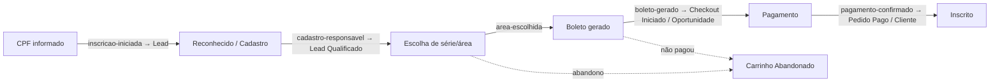
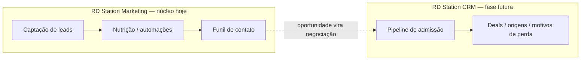

# Resumo Estratégico — RD Station no Portal de Inscrições

### CSA Leblon · Processo Seletivo 2027 — material para alinhamento com o parceiro de Marketing e CRM

> Versão executiva (resumida) do documento técnico `integracao_rd_station.md`.
> Foco: **estratégia de captação, nutrição e conversão de leads** e **o que decidir
> em conjunto** com a agência/parceiro de RD Station.

---

## 1. A ideia em uma frase

O **hotsite é o próprio portal de inscrição**. Cada visitante interessado é um **lead**
que pode (ou não) concluir a inscrição e pagar a taxa. A integração com o RD Station
existe para **medir e nutrir todo o percurso** — não só "quem clicou em inscrever", mas
**onde cada pessoa parou** e **qual origem traz matrícula**.

---

## 2. Princípios (boas práticas de CRM/marketing aplicadas)

- **Um contato, muitos eventos.** A chave é o **e-mail**; o RD deduplica e monta a linha
  do tempo do contato ao longo do funil.
- **Estágios de ciclo de vida.** Visitante → Lead → Lead Qualificado → Oportunidade →
  Cliente. Cada etapa do processo seletivo **promove** o contato.
- **Eventos no servidor (não pixel no browser).** Mais confiável (sem adblock) e seguro.
- **Medir abandono, não só sucesso.** O valor está em saber **onde as pessoas param**.
- **Atribuição real.** UTMs/origem desde o primeiro toque respondem "qual campanha gera
  matrícula", não só clique.
- **LGPD por design.** Consentimento explícito no formulário; o responsável já cadastrado
  tem relação/base legal com a instituição.

---

## 3. O funil mapeado em eventos

| Etapa do funil | Momento | Ciclo de vida RD |
| --- | --- | --- |
| `lead-captado` | Formulário de interesse | Lead |
| `inscricao-iniciada` | CPF reconhecido | Lead |
| `cadastro-responsavel` | Responsável confirmado | Lead Qualificado |
| `area-escolhida` | Série/área escolhida | Lead Qualificado |
| `boleto-gerado` | Taxa gerada (checkout iniciado) | Oportunidade |
| `pagamento-confirmado` | Taxa paga | Cliente |

---

## 4. Como os dois produtos do RD se encaixam

- **Marketing** é o **núcleo agora**: captura, nutrição e funil de contato (ciclo de vida).
- **CRM** entra **quando a equipe de admissão** for trabalhar os leads num pipeline de
  vendas (recuperação de boleto não pago, acompanhamento de matrícula).

---

## 5. Onde estamos x roadmap (visão de negócio)

| Fase | Entrega | Status |
| --- | --- | --- |
| **Passo 1** | Eventos de funil via API Key (sem custo de dev de OAuth) | **Parcial** — 2 eventos ativos (`inscricao-iniciada`, `boleto-gerado`) |
| **Passo 2** | OAuth + eventos de ciclo de vida e **e-commerce** (Checkout, Pedido Pago, Carrinho Abandonado) + webhooks | Planejado |
| **Passo 3** | RD Station **CRM** (pipeline de matrícula, deals, automação de recuperação) | Planejado |

> Hoje o disparo de eventos é **não-bloqueante**: qualquer falha do RD nunca interrompe a
> inscrição do candidato.

---

## 6. Métricas que vão guiar as decisões de campanha

- **Taxa de abandono por etapa** (onde perdemos o responsável).
- **Tempo entre etapas** (CPF → boleto; boleto → pagamento) → gargalos.
- **Reconhecido vs. novo** — conversão de quem já é da base (irmãos/ex-alunos) vs. lead frio.
- **Segmento/série com melhor conversão** (1º ano vs. demais séries).
- **Origem/UTM → matrícula** — atribuição real de campanha.
- **Multi-candidato** — responsáveis que inscrevem mais de um filho (modelo de irmãos do CSA).
- **Valor** (taxa de inscrição) nos eventos de e-commerce → receita potencial vs. realizada.

---

## 7. O que precisa ser feito do lado do RD Station (parceiro)

**Obrigatório para começar a medir já (Passo 1):**

1. Gerar o **token público (API Key)** numa conta administrador e nos repassar.
2. Criar os **campos personalizados** (custom fields) para rótulos legíveis e segmentação:
   `cf_etapa_funil`, `cf_ano_processo`, `cf_segmento_interesse`, `cf_idps`,
   `cf_responsavel_reconhecido`, `cf_consentimento_lgpd`, `cf_numero_inscricao`,
   `cf_valor_taxa`.
3. Configurar o **funil de contato (lifecycle)** associando os identificadores de
   conversão (`inscricao-2027-<etapa>`) aos estágios Lead → Cliente.

**Operação contínua de marketing:**

4. **Segmentações** por série, etapa e "reconhecido vs. novo".
5. **Automação de recuperação**: quem chegou a `boleto-gerado` e não a
   `pagamento-confirmado` recebe lembrete da taxa.

**Fases seguintes (decidir em conjunto):**

6. **App/OAuth + Webhooks** (Passo 2) para eventos de e-commerce e retorno de
   oportunidade/cliente.
7. **Estrutura do CRM** (Passo 3): pipeline de admissão, **origens** (sources) e
   **motivos de perda** (lost reasons).

---

## 8. Pontos para debater com o parceiro

- **Quem opera o quê?** Divisão entre escola (conteúdo/regras) e agência (campanhas,
  automações, relatórios).
- **Definição de "Oportunidade" e "Cliente"** no funil — alinhar com o vocabulário de
  admissão (inscrito × matriculado).
- **Mapa de automações de nutrição** (boas-vindas, lembrete de boleto, reengajamento de
  abandono) e respectivos conteúdos.
- **Plano de mídia e UTMs** padronizados para atribuição confiável.
- **Quando ligar o CRM** e quem serão os usuários (equipe de admissão).
- **LGPD**: textos de consentimento, retenção de dados e base legal por etapa.

---

> **Próximo passo sugerido:** validar este resumo, receber o **token (API Key)** e a
> **lista de custom fields criados**, e ligar o Passo 1 completo (incluindo o evento de
> topo `lead-captado` do formulário de interesse).
