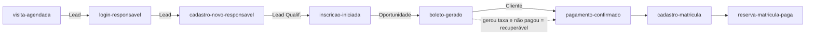
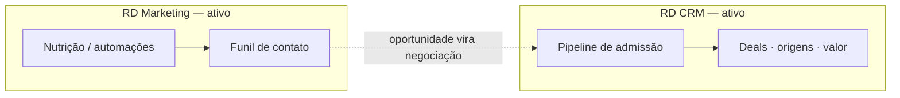

# Resumo Estratégico — RD Station no Portal de Admissão

### CSA Leblon · Processo Seletivo 2027 — material para a reunião com o parceiro de Marketing e CRM

> Versão executiva do documento técnico [integracao_rd_station.md](integracao_rd_station.md).
> Foco: **o que já fazemos hoje**, **o que isso já entrega de valor** e **o que decidir em
> conjunto** com o parceiro para refinar captação, nutrição e conversão.
> Atualizado em **2026-07-30** (auditado contra o código em produção).

---

## 1. A ideia em uma frase

O **hotsite é o próprio portal de admissão**. Cada pessoa que agenda uma visita, faz login,
cria conta ou inicia uma inscrição é um **contato** que pode (ou não) concluir a inscrição,
pagar a taxa e, aprovada, matricular. A integração com o RD Station existe para **medir e
nutrir todo o percurso** — não só "quem se inscreveu", mas **onde cada pessoa parou** e
**qual origem traz matrícula**.

---

## 2. Princípios (boas práticas de CRM/marketing já aplicadas)

- **Um contato, muitos eventos.** A chave é o **e-mail**; o RD deduplica e monta a linha do
  tempo do contato ao longo do funil.
- **Estágios de ciclo de vida.** Visitante → Lead → Lead Qualificado → Oportunidade →
  Cliente. Cada marco do processo **promove** o contato.
- **Eventos no servidor (não pixel no browser).** Mais confiável (sem adblock) e seguro —
  usamos dados que o navegador não deve ver (ex.: e-mail do responsável já cadastrado).
- **Automação dirigida por fato financeiro real.** Quem "virou cliente" é definido pelo
  **pagamento no ERP (TOTVS RM)**, não por clique — e de forma automática e idempotente.
- **Medir abandono, não só sucesso.** O valor está em saber **onde as pessoas param**.
- **Atribuição real.** Origem/UTM desde o primeiro toque respondem "qual campanha gera
  matrícula".
- **LGPD por design.** Token só no servidor; e-mail completo nunca vai ao navegador;
  consentimento governa Meta e Google Ads.

---

## 3. O funil real, hoje (eventos que de fato disparam)



| Evento | Momento | Ciclo de vida |
| --- | --- | --- |
| `visita-agendada` | Visita marcada no agendador | Lead |
| `login-responsavel` | Responsável já cadastrado faz login | Lead |
| `cadastro-novo-responsavel` | Novo responsável na 1ª inscrição | Lead |
| `inscricao-iniciada` | Começou a incluir um candidato | Lead Qualificado |
| `boleto-gerado` | Taxa gerada (inscrição concluída) | Oportunidade |
| `pagamento-confirmado` | Taxa paga (conciliado do RM) | Cliente |
| `cadastro-matricula` | Matrícula efetivada / reserva gerada | Cliente |
| `reserva-matricula-paga` | Reserva de R$ 2.200 paga | Cliente |

> **Importante:** hoje **não há captura de lead anônimo** (formulário de interesse) nem
> medição de abandono **dentro** do wizard. Todo contato só entra quando já tem e-mail. Isso
> é a principal oportunidade de evolução (§6).

---

## 4. Os dois produtos do RD, e o que mais já está ligado

- **RD Marketing (ativo):** contatos + eventos de funil (via API Key). Recebe a linha do
  tempo e alimenta segmentações/automações.
- **RD CRM (ativo):** pipeline de admissão com **negociações (deals)** criadas na inscrição
  e movidas automaticamente pelas conciliações do RM (taxa paga, reserva gerada, reserva
  paga). Usa **campos personalizados** e produtos (valor da taxa/reserva). A visita vira um
  deal e, quando a pessoa se inscreve, **os dois viram um só deal** (jornada consolidada).
- **Meta (Pixel + CAPI, ativo):** evento `Schedule` na visita, sob consentimento.
- **Google Ads (ativo):** conversão **"Inscrição Concluída"** no navegador, sob
  consentimento. Já capturamos `gclid` para futura importação de conversões offline
  (matrícula).



---

## 5. Onde estamos × roadmap (visão de negócio)

| Fase | Entrega | Status |
| --- | --- | --- |
| **Passo 1** | Eventos de funil via API Key (Marketing) | ✅ **Ativo** |
| **Passo 1b** | CRM: deals, taxa paga, etapas de matrícula, deal de visita | ✅ **Ativo** |
| **Passo 1c** | Meta CAPI + Google Ads (conversão de inscrição) | ✅ **Ativo** |
| **Passo 2** | OAuth + e-commerce nativo (Checkout / Pedido Pago / **Carrinho Abandonado**) + Webhooks + Analytics | 🔜 Planejado |

Pipeline operacional do CRM:

```text
Visita agendada → Visita realizada → Inscrito → Taxa paga → Prova/Entrevista →
Cadastro de matrícula → Pré-matrícula → Matriculado
```

*Cadastro de matrícula* = matrícula efetivada + boleto de reserva gerado. *Pré-matrícula* =
reserva de **R$ 2.200** paga. A aplicação concilia essas etapas pelo **estado financeiro
real do RM** e ajusta o valor do deal para o produto "Reserva de matrícula". Todo disparo é
**não-bloqueante**: falha do RD nunca interrompe a inscrição do candidato.

---

## 6. Análise: pontos fortes e o que refinar (o centro da reunião)

### ✅ O que já está de acordo com boas práticas

Contato único orientado a eventos; eventos server-side; Marketing + CRM integrados;
atribuição de origem; consentimento governando Meta/Google; **automação de estágio dirigida
pelo pagamento real** (idempotente, forward-only); e **jornada consolidada** (visita +
inscrição no mesmo deal, evitando duplicidade).

### 🔧 Oportunidades de refino (priorizadas)

| Prioridade | Oportunidade | Ganho | Quem faz |
| --- | --- | --- | --- |
| 🔴 Alta | **Recuperação de boleto:** fluxo "gerou taxa e não pagou em N dias → lembrete". O dado já existe. | Receita direta, sem código novo | Parceiro (RD) |
| 🔴 Alta | **Governança:** padronizar *sources*, UTMs de campanha, **motivos de perda** e **tipos** dos campos (valor como número/moeda). | Relatórios confiáveis | Parceiro + escola |
| 🔴 Alta | **Topo de funil anônimo:** formulário/LP de interesse (lead frio) para nutrir antes da inscrição. | Mais leads no topo | Parceiro (LP nativa) ou Dev |
| 🟡 Média | **Nutrição pós-visita:** hoje o comparecimento só existe no CRM; levá-lo ao Marketing habilita automação de agradecimento/convite. | Converte quem visitou | Dev + Parceiro |
| 🟡 Média | **Medir abandono no wizard** (evento por passo). | Recupera "quase-inscritos" | Dev |
| 🟡 Média | **Confiabilidade:** retry/backoff nos eventos de Marketing (hoje "dispare e esqueça"). | Menos evento perdido | Dev |
| 🟡 Média | **Passo 2** (OAuth + e-commerce + Webhooks): "carrinho abandonado" oficial e relatórios de receita. | Atribuição fina de receita | Dev |
| 🟢 Baixa | **LGPD:** registrar com o parceiro/DPO a base legal do evento de visita (enviado sem opt-in). | Conformidade | Escola + Parceiro |

---

## 7. Métricas que vão guiar as decisões de campanha

- **Taxa de abandono por etapa** — onde perdemos o responsável.
- **Tempo entre etapas** (inscrição → boleto → pagamento) — gargalos.
- **Reconhecido vs. novo** — conversão de quem já é da base (irmãos/ex-alunos) vs. lead frio.
- **Segmento/série com melhor conversão** (1º ano vs. demais).
- **Origem/UTM → matrícula** — atribuição real de campanha (não só clique).
- **Visita → inscrição → matrícula** — poder de conversão do agendamento de visita.
- **Multi-candidato** — responsáveis que inscrevem mais de um filho (modelo de irmãos).

---

## 8. O que precisamos do parceiro / o que decidir juntos

1. **Automações de nutrição** (prioridade na recuperação de boleto) — conteúdos e gatilhos.
2. **Governança de dados:** vocabulário de estágios (Oportunidade × Cliente × Inscrito ×
   Matriculado), *sources*, UTMs e **motivos de perda** padronizados.
3. **Topo de funil:** vamos de formulário/LP **nativos do RD** (parceiro) ou construímos a
   captura no portal (dev)?
4. **Campos personalizados:** revisar rótulos/tipos no RD (deixar valores como moeda) para
   relatórios limpos.
5. **Divisão de responsabilidades:** escola (conteúdo/regras) × agência (campanhas,
   automações, relatórios).
6. **LGPD:** textos de consentimento, retenção e base legal por etapa.

---

> **Próximo passo sugerido:** validar este resumo, ligar a **automação de recuperação de
> boleto** (ganho rápido) e fechar o **plano de governança** (sources/UTMs/campos) antes do
> pico do processo 2027.
