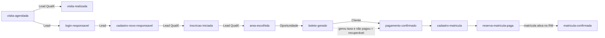
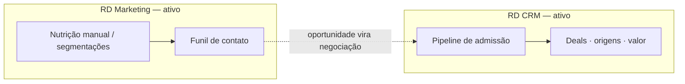

# Resumo Estratégico — RD Station no Portal de Admissão

### CSA Leblon · Processo Seletivo 2027 — material para a reunião com o parceiro de Marketing e CRM

> Versão executiva do documento técnico [integracao_rd_station.md](integracao_rd_station.md).
> Foco: **o que já fazemos hoje**, **o que isso já entrega de valor** e **o que decidir em
> conjunto** com o parceiro para refinar captação, nutrição e conversão.
> Atualizado em **2026-08-03** (auditado contra o código em produção; inclui a automação da
> etapa *Matriculado*, os eventos `visita-realizada`/`area-escolhida`, `CompleteRegistration`
> no Meta e a dependência do contrato via DocuSign).

---

## 1. A ideia em uma frase

O **hotsite é o próprio portal de admissão**. Cada pessoa que agenda uma visita, faz login,
cria conta ou inicia uma inscrição é um **contato** que pode (ou não) concluir a inscrição,
pagar a taxa e, aprovada, matricular. A integração com o RD Station existe para **medir e
nutrir todo o percurso** — não só "quem se inscreveu", mas **onde cada pessoa parou** e
**qual origem traz matrícula**.

---

## 2. Princípios (boas práticas de CRM/marketing já aplicadas)

- **Um contato, muitos eventos.** A chave é o **e-mail**; o RD deduplica e monta a linha do
  tempo do contato ao longo do funil.
- **Estágios de ciclo de vida.** Visitante → Lead → Lead Qualificado → Oportunidade →
  Cliente. Cada marco do processo **promove** o contato.
- **Eventos no servidor (não pixel no browser).** Mais confiável (sem adblock) e seguro —
  usamos dados que o navegador não deve ver (ex.: e-mail do responsável já cadastrado).
- **Automação dirigida por fato financeiro real.** Quem "virou cliente" é definido pelo
  **pagamento no ERP (TOTVS RM)**, não por clique — e de forma automática e idempotente.
- **Medir abandono, não só sucesso.** O valor está em saber **onde as pessoas param**.
- **Atribuição real.** Origem/UTM desde o primeiro toque respondem "qual campanha gera
  matrícula".
- **LGPD por design.** Token só no servidor; e-mail completo nunca vai ao navegador;
  consentimento governa Meta e Google Ads.

---

## 3. O funil real, hoje (eventos que de fato disparam)



| Evento | Momento | Ciclo de vida |
| --- | --- | --- |
| `visita-agendada` | Visita marcada no agendador | Lead |
| `visita-realizada` | Presença confirmada na visita (chamada) | Lead Qualificado |
| `login-responsavel` | Responsável já cadastrado faz login | Lead |
| `cadastro-novo-responsavel` | Novo responsável na 1ª inscrição | Lead |
| `inscricao-iniciada` | Começou a incluir um candidato | Lead Qualificado |
| `area-escolhida` | Escolheu a área/segmento no wizard | Lead Qualificado |
| `boleto-gerado` | Taxa gerada (inscrição concluída) | Oportunidade |
| `pagamento-confirmado` | Taxa paga (conciliado do RM) | Cliente |
| `cadastro-matricula` | Matrícula efetivada / reserva gerada | Cliente |
| `reserva-matricula-paga` | Reserva de R$ 2.200 paga | Cliente |
| `matricula-confirmada` | Matrícula **ativa** no RM → etapa *Matriculado* (quando configurada) | Cliente |

> **Importante:** já medimos abandono **dentro** do wizard — `inscricao-iniciada` e
> `area-escolhida` mostram até onde a pessoa avançou antes de gerar o boleto. O que ainda
> **não** temos é **captura de lead anônimo** (formulário de interesse sem e-mail): todo
> contato só entra no RD quando já tem e-mail. Essa é a principal oportunidade de evolução (§6).

---

## 4. Os dois produtos do RD, e o que mais já está ligado

- **RD Marketing (ativo):** contatos + eventos de funil (via API Key). Recebe a linha do
  tempo e alimenta as segmentações (trabalhadas manualmente pela equipe do parceiro).
- **RD CRM (ativo):** pipeline de admissão com **negociações (deals)** criadas na inscrição
  e movidas automaticamente pelas conciliações do RM (taxa paga, reserva gerada, reserva
  paga). Usa **campos personalizados** e produtos (valor da taxa/reserva). A visita vira um
  deal e, quando a pessoa se inscreve, **os dois viram um só deal** (jornada consolidada) —
  quando a consolidação está habilitada na configuração do sistema.
- **Meta (Pixel + CAPI, ativo):** `Schedule` na visita e `CompleteRegistration` na inscrição
  concluída e na matrícula, sob consentimento.
- **Google Ads (ativo):** conversão **"Inscrição Concluída"** no navegador, sob
  consentimento. Já capturamos `gclid` para futura importação de conversões offline
  (matrícula).



**Marketing × CRM em uma linha.** O mesmo fato pode aparecer nos dois sem ser duplicidade: o
**Marketing registra o que aconteceu** (a linha do tempo do contato — para *medir e nutrir*); o
**CRM registra o que há para trabalhar** (a negociação — para a equipe *operar*). Por isso a
visita é evento **e** deal: um fato a medir e uma negociação a trabalhar. Diferença prática — o
Marketing **acumula** todos os eventos; o CRM **consolida** num só deal por jornada.

---

## 5. Onde estamos × roadmap (visão de negócio)

| Fase | Entrega | Status |
| --- | --- | --- |
| **Passo 1** | Eventos de funil via API Key (Marketing) | ✅ **Ativo** |
| **Passo 1b** | CRM: deals, taxa paga, etapas de matrícula, deal de visita | ✅ **Ativo** |
| **Passo 1c** | Meta CAPI + Google Ads (conversão de inscrição) | ✅ **Ativo** |
| **Passo 2** | OAuth + e-commerce nativo (Checkout / Pedido Pago / **Carrinho Abandonado**) + Webhooks + Analytics | 🔜 Planejado |

Pipeline operacional do CRM:

```text
Visita agendada → Visita realizada → Inscrito → Taxa paga → Prova/Entrevista →
Cadastro de matrícula → Pré-matrícula → Matriculado
```

*Cadastro de matrícula* = matrícula efetivada + boleto de reserva gerado. *Pré-matrícula* =
reserva de **R$ 2.200** paga. *Matriculado* = **matrícula ativa no RM** (status oficial). A
aplicação concilia essas etapas pelo **estado real do RM** (financeiro e de matrícula) e
ajusta o valor do deal para o produto "Reserva de matrícula". Todo disparo é
**não-bloqueante**: falha do RD nunca interrompe a inscrição do candidato.

> **Nota sobre *Matriculado*:** a matrícula efetiva não depende só do pagamento da reserva —
> exige também a **assinatura do contrato**, feita pela plataforma **DocuSign** (assinatura
> eletrônica). A **integração desse processo de assinatura com o sistema ainda está em
> desenvolvimento**; por isso o sinal que hoje move o deal para *Matriculado* é o **status
> oficial da matrícula no RM** (que a secretaria só ativa após contrato + reserva em ordem).

> **Novidade (2026-07-31):** *Matriculado* deixou de ser marcada só à mão — o sistema move o
> deal para lá automaticamente quando a matrícula fica **ativa no RM**. Basta mapear a etapa
> na configuração (`RD_CRM_DEAL_STAGE_MATRICULADO_ID`); enquanto não for mapeada, o pipeline
> para em *Pré-matrícula* e a marcação segue manual.

---

## 6. Análise: pontos fortes e o que refinar (o centro da reunião)

### ✅ O que já está de acordo com boas práticas

Contato único orientado a eventos; eventos server-side; Marketing + CRM integrados;
atribuição de origem; consentimento governando Meta/Google; **automação de estágio dirigida
pelo pagamento real** (idempotente, forward-only); e **jornada consolidada** (visita +
inscrição no mesmo deal, evitando duplicidade).

### ✅ Implementado recentemente (dev)

Itens que **eram propostas** na versão anterior e já estão no ar do lado do sistema — falta só
a ação do parceiro no RD, quando indicada:

- **`area-escolhida`** — o abandono no formulário agora é medido **por série/segmento**.
  *(Falta a equipe do parceiro: contatar manualmente quem escolheu a série e não concluiu.)*
- **`visita-realizada` no Marketing** — o comparecimento à visita, que antes só existia no CRM,
  agora também dispara evento de Marketing. *(Falta a equipe do parceiro: enviar agradecimento +
  convite a se inscrever.)*
- **Retry/backoff nos eventos de Marketing** — se um envio falhar por instabilidade de rede, o
  sistema **reenvia automaticamente**. *(Concluído.)*
- **Etapa *Matriculado* automatizada** — o deal avança sozinho para *Matriculado* quando a
  matrícula fica **ativa no sistema oficial (RM)**, com o evento `matricula-confirmada`. Antes,
  era a única etapa marcada à mão. *(Pronto; ativa ao mapear a etapa na config — enquanto isso,
  o pipeline para em Pré-matrícula.)*

> ⚠️ **Automático × manual — evitar intervenções equivocadas.** Boa parte das **transições de
> etapa no CRM** e da **classificação de funil no Marketing** é feita **automaticamente pelo
> sistema** (via API, a partir do pagamento real) — editar esses itens à mão no RD pode ser
> sobrescrito pela automação. Já a **temperatura do lead** (quente/morno/frio), a
> **qualificação** e os **motivos de perda** **não** são tocados pelo sistema: são
> manuais/parceiro. O guia operacional completo (o que **não** mexer à mão × o que **é**
> manual) está na versão não técnica:
> [resumo-rd-station-nao-tecnico.md](resumo-rd-station-nao-tecnico.md) §6.

### 🔧 Oportunidades de refino (priorizadas)

| Prioridade | Oportunidade | Ganho | Quem faz |
| --- | --- | --- | --- |
| 🔴 Alta | **Recuperação de boleto:** rotina manual "gerou taxa e não pagou em N dias → lembrete". O dado/lista já existe. | Receita direta, sem código novo | Equipe do parceiro |
| 🔴 Alta | **Governança:** padronizar *sources*, UTMs de campanha, **motivos de perda** e **tipos** dos campos (valor como número/moeda). | Relatórios confiáveis | Parceiro + escola |
| 🔴 Alta | **Topo de funil anônimo:** formulário/LP de interesse (lead frio) para nutrir antes da inscrição. | Mais leads no topo | Parceiro (LP nativa) ou Dev |
| 🟡 Média | **Contato pós-visita:** enviar (manualmente) agradecimento + convite (base técnica pronta — `visita-realizada` já vai ao Marketing). | Converte quem visitou | Equipe do parceiro |
| 🟡 Média | **Trabalhar "quase-inscritos":** segmentar sobre `area-escolhida` sem `boleto-gerado` e contatar à mão (base técnica pronta). | Recupera quem quase se inscreveu | Equipe do parceiro |
| 🟡 Média | **Classificação de leads padronizada** (temperatura + qualificação): tabela de referência aplicada **à mão** pela equipe. Detalhes na versão não técnica §6.4. | Prioriza o esforço comercial; menos erro operacional | Equipe do parceiro |
| 🟡 Média | **Passo 2** (OAuth + e-commerce + Webhooks): "carrinho abandonado" oficial e relatórios de receita. | Atribuição fina de receita | Dev |
| 🟢 Baixa | **LGPD:** registrar com o parceiro/DPO a base legal do evento de visita (enviado sem opt-in). | Conformidade | Escola + Parceiro |

---

## 7. Métricas que vão guiar as decisões de campanha

- **Taxa de abandono por etapa** — onde perdemos o responsável.
- **Tempo entre etapas** (inscrição → boleto → pagamento) — gargalos.
- **Reconhecido vs. novo** — conversão de quem já é da base (irmãos/ex-alunos) vs. lead frio.
- **Segmento/série com melhor conversão** (1º ano vs. demais).
- **Origem/UTM → matrícula** — atribuição real de campanha (não só clique).
- **Visita → inscrição → matrícula** — poder de conversão do agendamento de visita.
- **Multi-candidato** — responsáveis que inscrevem mais de um filho (modelo de irmãos).

---

## 8. O que precisamos do parceiro / o que decidir juntos

1. **Rotinas de nutrição/contato** (prioridade na recuperação de boleto) — conteúdos, cadência
   e **quem** faz o disparo manual (o parceiro opera o RD à mão, sem automações).
2. **Governança de dados:** vocabulário de estágios (Oportunidade × Cliente × Inscrito ×
   Matriculado), *sources*, UTMs e **motivos de perda** padronizados.
3. **Topo de funil:** vamos de formulário/LP **nativos do RD** (parceiro) ou construímos a
   captura no portal (dev)?
4. **Campos personalizados:** revisar rótulos/tipos no RD (deixar valores como moeda) para
   relatórios limpos.
5. **Divisão de responsabilidades:** escola (conteúdo/regras) × agência (campanhas, operação
   manual do RD, relatórios).
6. **LGPD:** textos de consentimento, retenção e base legal por etapa.

---

> **Próximo passo sugerido:** validar este resumo, iniciar a **rotina (manual) de recuperação
> de boleto** (ganho rápido) e fechar o **plano de governança** (sources/UTMs/campos) antes do
> pico do processo 2027.
